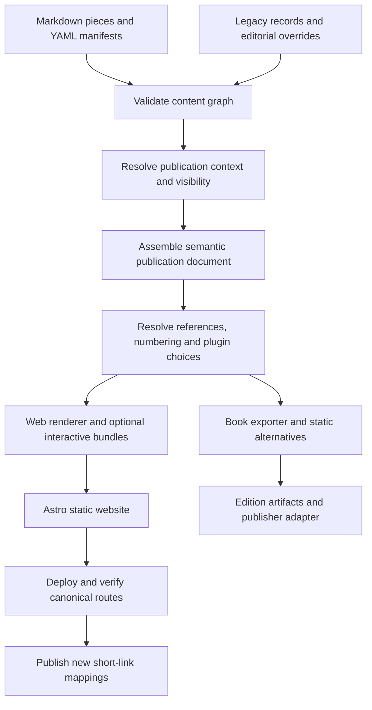

# Technical architecture and implementation decisions

Status: implemented and deployed at the root; short-link cloud setup remains pending.
Date: 2026-09-15. These choices implement the [product design](product-design.md)
and [content model](content-model.md); they do not redefine those requirements.
Changing a tool requires updating its adapter/decision, not the editorial model.

## 1. Decision summary

| Area | Initial choice | Reason / boundary |
| --- | --- | --- |
| Website | Astro, static output | Content-oriented rendering with optional interactive islands |
| Implementation | TypeScript in strict mode | Explicit schemas and plugin contracts |
| Runtime/package manager | Node.js 24.21.0 LTS; npm 12.0.2 | Pinned across local, Amplify and GitHub builds |
| Authoring | Markdown + YAML metadata/manifests | Portable prose and inspectable structure |
| Parsing | unified / remark / rehype, with remark-directive | Parse semantic blocks before HTML generation |
| Validation | Zod schemas; exportable JSON Schema where practical | Build validation plus future editor assistance |
| Content integration | Astro Content Collections around a framework-independent content core | Use Astro for loading/pages without binding the book model to Astro |
| Styling | Versioned themes, validated site configuration, CSS custom properties and scoped CSS | Replace appearance/layouts without rewriting content or publishing logic |
| Code | Shiki adapter | Build-time highlighting; source code remains portable |
| Tables | Semantic HTML adapter; structured export adapter | Preserve values/header semantics |
| Charts | Vega-Lite adapter, accepting chart-v1 or native Vega-Lite input | Shared data/specification with static export |
| Diagrams | Mermaid and D2 adapters; ELK initial layout where supported | Different source languages behind a common figure contract |
| Mathematics | KaTeX web adapter | Typeset equations with a separate book-export path |
| Images | Image adapter using Astro/Sharp for web derivatives | Keep originals, captions, and export renditions distinct |
| Interactivity | Registered JS modules; Web Workers for computation; WASM where useful | Load only the requested experiment |
| Browser model runtime | Replaceable runtime; WebLLM worker adapter | Never a content-model dependency; validate model compatibility |
| Hosting | Existing AWS Amplify app, Amazon Linux 2023 | Preserve automatic deployment from main |
| Short links | CloudFront Function + KeyValueStore; S3 registry snapshots | HTTP redirects compatible with the actual existing origin setup |
| Book output | Markua export and separate Leanpub adapter | Preserve an independent route to other formats/publishers |
| Tests | node:test for the core; browser testing for the implemented UI | Exercise semantics and user behavior at the appropriate layer |

Use the current stable release of each selected library when the corresponding
phase begins, pin resolved versions in the lockfile, and record tool/binary/font
versions used for edition artifacts. Do not use runtime CDN “latest” imports.
Resolved versions are installed and recorded in package-lock.json. See
[implementation status](implementation-plan.md) and [operations](operations.md)
for actual module locations, commands and account-dependent limits.

The rebuild pins Node 24.21.0 LTS and npm 12.0.2 and uses Astro 7.3.2.
TypeScript remains at 6.0.3 because Astro's checker does not support TypeScript 7's
compiler API. See [dependencies and hosting](dependencies-and-hosting.md) for
version exceptions, install-script policy, and hosted verification.
[Astro setup](https://docs.astro.build/en/install-and-setup/),
[content collections](https://docs.astro.build/en/guides/content-collections/).

## 2. Boundaries and build pipeline



The core uses a typed intermediate document containing prose, headings,
placements, references, citations, and typed blocks. It is independent of Astro
components and any one rendering engine. Book export starts from this document,
not from scraping generated HTML.

Assembly selects a publication target before resolving visibility or assets.
Only assets reachable from eligible pieces are copied into public outputs.
A standalone piece has no collection context; a collection view uses its own
placements, contextual titles, and settings.

Current Open Graph code remains a legacy-source adapter. Preserve the existing
precedence of raw cache, imported metadata, and per-field editorial overrides.
Discovery remains an explicit authoring command; production builds consume
reviewed source data and do not silently discover new publications.

### Theme and template boundary — required for the rebuild

Keep three layers distinct: the content/publishing core, registered rich-content
renderer plugins, and the site's theme. The core prepares typed page data; a theme
supplies layouts and styling for that data. Themes cannot redefine visibility,
canonical URLs, collection membership, lead selection, or book assembly.

Initial representation:

- `publishing/site.yaml`: brand text, active theme ID, design-token overrides,
  named image/asset references, and supported layout selections.
- `themes/<theme-id>/`: a versioned manifest, default tokens, CSS, named image
  slots, and Astro templates for home/article/collection/archive pages.
- An explicit theme registry resolves IDs to local installed code. Configuration
  cannot fetch or execute arbitrary templates or remote scripts.

Use CSS custom properties for colors, type families/scales, spacing, widths, and
rules. Resolve configured fonts to registered, licensed font assets. Resolve
portrait/decorative-image slots through the asset layer rather than hard-coded
paths inside page templates; keep alt text and relevant crop/focal-point settings
with each slot. Article figures and gallery sources remain owned by content.

Theme defaults are overridden by validated site settings, then optional local
override CSS loaded last. Supported layout IDs can be selected in configuration;
an entirely new structure requires a compatible template implementation. Define
shared page-data contracts and required theme slots so replacement does not require
rewriting articles. Invalid theme/layout/asset references fail the build clearly.
Editorial homepage configuration remains separate from layout configuration.

Theme changes trigger a site rebuild. Include theme/version and resolved visual
settings in relevant rendition cache keys, especially when plugins consume theme
colors or fonts. CSS-only changes do not alter the raw Open Graph metadata cache.
Book render settings are independent; frozen editions retain their recorded
typography and asset versions when the website theme changes.

The existing visual prototype has editable CSS and images but does not implement
this configuration/registry boundary yet. Implement it with the production pages,
and prove a theme change against the same representative content before cutover.

### Initial route plan

- `/` — editorial homepage with curated/default article selection and collections.
- `/writing/<slug>/` — an independently published article.
- `/collections/<slug>/` — a collection introduction and table of contents.
- `/collections/<slug>/chapters/<node-id>/` — an assembled chapter or appendix.
- `/collections/<slug>/read/<placement-id>/` — a piece in its collection context.
- `/archive/` — entry point for historical material; Earlier Work, styled in the new theme. `/original-site/` serves
  The Original Site, the preserved dated snapshot.

Front/back matter and contextual supporting pieces render within their permitted
assembly and do not automatically receive independent routes. Stable placement
IDs supply anchors and disambiguation. Every published page has one canonical
URL appropriate to its context; contextual titles and supporting text belong to
the collection page, while the standalone article retains its own canonical URL.
Track old slugs and generate redirects when they change. Record an explicit
compatibility map for legacy `.html` routes before production cutover.

### Homepage selection

Keep homepage curation separate from article bodies and book order. A small
versioned configuration references an optional lead piece and selected collections
by stable ID. Resolve the lead from that reference or the newest eligible public
standalone piece, then fill the recent list by publication date, excluding the
lead. Use a stable ID tie-breaker. Exact configuration syntax and item counts are
defined during homepage implementation.

Explicit references to missing or ineligible content produce a validation error;
an omitted lead permits automatic selection. Apply publication visibility before
rendering all sections, omit empty sections, and preserve original dates. Render
at build time with no client-side ranking dependency. Update-based editorial
features are explicit; metadata corrections must not silently reorder the feed.
External publication inclusion is a separate editorial decision and must preserve
publisher/destination labels. The initial automatic feed uses first-party pieces.

## 3. Markdown and semantic blocks

### Design prototype boundary

`prototypes/ink-and-paper` is an isolated React/Vite prototype created from the
selected Ink & Paper visual. It uses local sample data and dialog-based reading
to validate appearance and interactions. It does not change the selected Astro,
TypeScript, Markdown/YAML production architecture. Fonts, image assets, and CSS
are candidates for reuse after refinement, not a new content/runtime dependency.
No production deployment or external publishing integration was changed.

### Production authoring

Use ordinary Markdown for prose and simple content. Add directives for references,
reusable blocks, and contextual structures. Parse these with remark plugins into
typed nodes; a rehype stage is used only for the final web output.

The source dialect is versioned as described in [authoring format](authoring-format.md).
The directive parser supplies syntax, not publishing behavior; the content core
implements that behavior. Native MDX/JSX is excluded from the portable prose
format. Interactive code lives in separately registered modules referenced by ID.

This keeps book export from depending on arbitrary UI components embedded inside
paragraphs. An advanced renderer-specific source can still be used when its
format and export alternatives are explicit.
[Astro Markdown processing](https://docs.astro.build/en/guides/markdown-content/),
[remark-directive](https://github.com/remarkjs/remark-directive).

## 4. Plugin contracts

Plugins have versioned IDs, declared input formats, output targets, option
schemas, and capabilities. Static rendering and browser execution use separate
contracts. The signatures below are design interfaces, not implemented APIs.

```typescript
type Target = 'web' | 'book';

interface RendererPlugin {
  id: string;
  version: string;
  kinds: string[];
  sourceFormats: string[];
  targets: Target[];
  validateOptions(options: unknown): void;
  render(request: RenderRequest): Promise<RenderResult>;
}

interface RenderRequest {
  block: ResolvedBlock;       // core-owned semantic block
  target: Target;
  options: unknown;           // already validated for this plugin
  assets: AssetResolver;      // resolves source-owned, versioned assets
}

interface RenderResult {
  rendition: Rendition;       // typed HTML, SVG, image, or structured export data
  assets: GeneratedAsset[];
  dependencies: DependencyVersion[];
  diagnostics: Diagnostic[];
}

interface ExperimentRuntimePlugin {
  id: string;
  version: string;
  capabilities: string[];
  modelFormats: string[];
  backends: string[];
  locality: 'local' | 'remote';
  probe(request: ExperimentRequest): Promise<CompatibilityReport>;
  load(request: ExperimentRequest, signal: AbortSignal): Promise<Session>;
}

// Session owns run(input, signal), stop(), reset(), and dispose().
// Scenario/state capture is a declared capability, not assumed for every model.
```

The referenced core types will be defined in the first implementation phase.
They must not expose a particular chart library or inference API in the shared
contract. Model-specific capabilities such as token probabilities remain optional.

The publishing core owns captions, accessible descriptions, anchors, numbering,
and cross-references. A plugin supplies the content rendition, not a competing
caption or navigation system. Adapter outputs are validated/sanitized where needed.

### Selection and compatibility

Resolve each target separately, from site to collection to piece to placement to
block, as specified in [authoring format](authoring-format.md). A changed plugin
ID resets inherited options from another plugin; same-plugin options may merge.

A source-format mismatch is an error unless an explicit converter exists.
Replacing a highlighter generally preserves source code. Replacing Mermaid
with D2 requires source conversion; replacing a model runtime may require
compatible weights/tokenization. Do not promise lossless universal interchange.

Plugins are explicitly registered code dependencies. Content cannot install
packages or import arbitrary remote scripts by naming a plugin.

## 5. Static rendering decisions

### Document and presentation adapters

Initial adapters: `pdf-native` for browser PDF viewing, `google-docs-published`
for published Docs, and `google-slides-published` for published Slides. Content
kinds remain `document` and `presentation`; the adapter is independently selected.
Start PDF support with a browser viewer and a direct file link. A richer viewer
can replace that adapter later without changing source identity.

Accept local PDFs or public HTTPS sources. Google adapters accept the published
view/embed URLs provided by Google, validate their host/path, and generate the
iframe themselves. Do not accept arbitrary pasted iframe HTML or treat an edit
URL as a public embed. Remote PDF hosts may disallow framing; retain the direct
link, and require an explicit local snapshot if inline viewing is essential.

Use titled, responsive frames with bounded heights, provider-specific permissions
and a matching Content Security Policy. Load third-party frames on activation by
default. Keep the summary/open-original link outside the frame: cross-origin frame
errors and sign-in screens cannot reliably be detected by the parent page.
The website requires no Google OAuth tokens or access to the publishing account.

#### Publishing from another Google account

For embedded Docs/Slides, use **File → Share → Publish to web → Embed** in the
owning account, then supply the published URL. The resulting view is read-only.
Work/school policies may restrict public publishing. Updates can propagate to
the published view; Slides cannot disable automatic updates. To withdraw a
published view, stop publishing it; sharing permissions are managed separately.
[Google publishing guidance](https://support.google.com/docs/answer/183965?hl=en).

For a normal viewing link, set **General access → Anyone with the link → Viewer**
where available. Viewer access prevents editing/commenting; downloading is allowed
by default. It is distinct from publishing an embeddable version.
[Google sharing guidance](https://support.google.com/docs/answer/2494822?hl=en).

Before including a source, verify the actual viewing/embed URL in a signed-out
browser, including on mobile. The site does not change external permissions.

#### Static output and editions

Every block declares an authored summary/reference or local static alternative.
The selected document adapter handles the book alternative; it never embeds an
iframe in a manuscript. Selected PDF pages/slide images need explanatory text.
Store approved exports as versioned assets, with capture date and computed hash.
Live URLs are references, not immutable edition assets. Permission changes or
withdrawal at Google do not remove copies already exported into this repository.
Builds validate local descriptors and fallbacks without fetching live sources;
remote availability checks are a separate publication preflight.

### Gallery providers and viewers

Add `gallery` blocks with separate source-provider and viewer adapters. Providers
declare whether they can supply a public album link, a verified frame URL, or an
enumerated set of stable image assets and metadata. A native grid/lightbox viewer
requires the last capability; a public album page alone does not provide it.
The initial `icloud-shared-album` provider uses an author-supplied public album
URL. The baseline `gallery-link` viewer renders a title, summary, and album link.
Enable an inline viewer only after testing a real album's framing policy and
signed-out desktop/mobile behavior. No working embed or photo enumeration has
been verified, and a link card must not be described as an embedded gallery.

Apple documents Shared Albums with **Public Website** enabled for anonymous
viewing. Its documentation reviewed on 2026-09-15 does not establish a supported
third-party website embedding interface. Avoid temporary iCloud Links, which
expire after 30 days, and any album configured to expire. Public access must be
checked on the actual album; it is not implied by an ordinary library URL.
[Public albums](https://support.apple.com/guide/iphone/add-and-remove-people-in-a-shared-album-ipha8f8fc3c5/26/ios/26),
[Temporary iCloud Links](https://support.apple.com/en-au/guide/icloud/mm93a9b98683/1.0/icloud/1.0).

Apple's documented traditional Shared Albums reduce photo resolution (normally
2,048 pixels on the long edge), so verify the actual album's quality before using
it for detailed photography or book images; sharing modes can differ.
[Shared Album formats](https://support.apple.com/en-gb/108314).

Do not use undocumented scraping, harvested temporary CDN URLs, Apple credentials,
or an automatic media mirror as the default integration. The build stores only
editorial metadata and references; it does not fetch album photos into the repo
or build output. A future external asset-storage adapter could serve explicitly
selected web derivatives for a custom gallery, but that copying workflow remains
an open choice. Remote previews also require a stable, permitted source; otherwise
render the album card without a thumbnail.

The gallery adapter uses its book target to render the authored summary/reference or approved
versioned external assets with verified hashes. Plain builds need no album access.
Unavailable providers preserve the surrounding article and original album link.
Any verified third-party frame follows the activation/CSP rules above.

### Other static content

- **Code:** preserve code and language; highlight at build time with Shiki.
  Named-region includes are preferred over brittle line ranges for maintained
  examples. Copy controls are optional web enhancement. Book adapters receive
  structured listings and source, not Shiki-specific HTML.
- **Charts:** chart-v1 covers a small shared vocabulary. The initial adapter
  converts it to Vega-Lite. Native Vega-Lite input is permitted for advanced work.
  Pin datasets and record transformations. Render SVG by default, with PDF/PNG
  derivatives when an exporter requires them. Optional interaction loads later.
- **Tables:** preserve typed columns and semantic headers. Browser sorting must
  not change the authored book order. Large tables require an editorial layout.
- **Diagrams:** render Mermaid/D2 during the build. Start with ELK where the
  selected version/diagram type supports it; validate engine-specific options.
  Keep separate adapters and source formats. Layout results need visual review.
- **Math:** use KaTeX for web output. Export semantic math where supported;
  otherwise use a deliberate static rendition and explanation.
- **Figures:** asset processing centralizes widths, captions, descriptions, and
  theme variants. Keep vector originals for diagrams/charts and sufficient
  resolution for raster images. Do not assume a web-sized image is print-ready.

Cache generated assets by source/data hash, selected plugin/version/options,
fonts, and output target. Captions/numbering are contextual and cannot be cached
as if they were global properties of the source asset.

Sources: [Shiki](https://shiki.style/guide/),
[Vega-Lite data](https://vega.github.io/vega-lite/docs/data.html),
[Vega-Lite export](https://vega.github.io/vega-lite/usage/compile.html),
[Mermaid layouts](https://mermaid.js.org/config/layouts.html),
[D2 layouts](https://d2lang.com/tour/layouts/),
[KaTeX](https://katex.org/docs/api).

## 6. Browser experiments

Use custom elements or small framework-independent modules for experiment UI.
Load on deliberate reader activation. Run substantial computation in Workers;
use WASM for workloads or existing libraries that benefit from it. Workers keep
the UI responsive; demonstrations requiring an isolation boundary use a sandboxed
iframe rather than treating a Worker as a security boundary.

Model experiments select a runtime through the registry. WebLLM is the initial
adapter for compatible LLMs, and can be replaced. A model manifest
records source format, exact artifacts/tokenizer, checksums, and compatible
plugins/backends. Backend options include WebGPU and supported WASM paths;
WebNN can be added through an adapter as real device support warrants it.

Probe support before downloading. Show total download/progress, allow cancellation,
and release resources on disposal. Share cached model assets when the browser
permits, with storage limits and an explicit clear action. Do not include model
weights in the normal page bundle or initiate downloads during reading.

Local-only content rejects remote runtimes. There is no automatic cloud fallback.
Unsupported devices show authored static results. Recorded book examples retain
inputs, versions, settings, and actual outputs rather than promising deterministic
LLM generation across hardware.

Sources: [WebGPU](https://developer.mozilla.org/en-US/docs/Web/API/WebGPU_API),
[WebLLM](https://webllm.mlc.ai/docs/),
[Transformers.js](https://huggingface.co/docs/transformers.js/en/index),
[WebNN specification](https://webmachinelearning.github.io/webnn/).

## 7. Short-link integration

### Verified current state

Read-only AWS inspection on 2026-09-15 found:

| Resource | Observed state |
| --- | --- |
| Public hostname | `danilop.link` |
| CloudFront distribution | Recorded in the private operations note; discover by domain alias |
| Origin bucket | `danilop-link` in `eu-west-1` |
| Origin endpoint | `danilop-link.s3.amazonaws.com` (S3 REST origin) |
| Bucket contents | Empty at inspection |
| Website configuration | None |
| Edge functions / Lambda@Edge | None attached |
| Additional cache behaviors / error responses | None |
| Viewer protocol policy | Redirect HTTP to HTTPS |

The bucket is named `danilop-link`, not `danilop.link`. Existing resources provide
hosting infrastructure but no observed short-link resolution. Initial resolver/IAM setup remains pending the specific access approval in
[deployment access review](deployment-access-review.md).

### Chosen implementation

Use a viewer-request CloudFront Function with a KeyValueStore registry for HTTP
redirects. Keep the S3 bucket as the origin and as storage for versioned registry
snapshots/manifests. Do not rely on S3 website-redirect metadata through this REST
origin; that mechanism requires different origin behavior.

The version-controlled `publishing/links.yaml` maps a code to a content ID and,
optionally, an edition/scenario. A compiler resolves it to a verified HTTPS
canonical destination. Initial codes use lowercase ASCII letters, digits, and
hyphens, start with a letter or digit, and contain 1–64 characters. Reserve
infrastructure paths separately and validate collisions in the schema.
Use human-selected codes, reserving drafts without activating them.

The function handles GET/HEAD and returns a 302 with a short cache lifetime
(initially 60 seconds) for managed aliases. Even an identity-stable alias may
need a new physical destination later. Unknown paths return a static 404; the root redirects to the website. The
resolver does not pass arbitrary paths to the origin/publication ledger. Incoming query parameters never become
an arbitrary redirect destination; configured target queries encode approved scenarios.

Only native new publications enter this registry automatically. Never repurpose
codes or delete edition aliases as a consequence of a content-list refresh.

### Publication sequence

1. Validate code ownership, collisions, target visibility, and destination mapping.
2. Build and deploy the canonical site through the existing Amplify pipeline.
3. Verify the exact commit's deployment and public destinations.
4. Upload a versioned registry snapshot to a dedicated S3 prefix.
5. Apply idempotent KeyValueStore updates using ETags; verify representative aliases.
6. Record the deployment/registry revision and retain rollback data.

Choose a small GitHub Actions coordinator triggered on pushes to `main`. It uses
AWS OIDC credentials, waits for the matching Amplify commit/job, and reads a
public build.json marker to confirm the deployed commit. It does not duplicate
the website build. Serialize link publication and reject stale runs when a newer
commit is already live. Bound waits and surface failures.

Give this job only the AWS permissions needed to inspect deployment, write the
managed snapshot prefix, and update its registry. Initial edge-function/IAM setup
is a separate infrastructure change. A failure after site deployment leaves
existing aliases intact and reports the pending new aliases for retry. Site and
link updates are not assumed to be one atomic transaction.

For ongoing updates use the KeyValueStore API with ETag checks; S3 import is an
initialization feature, not a live synchronization mechanism. Rollback verifies
that earlier destinations still exist before restoring mappings.

Sources: [CloudFront redirects](https://docs.aws.amazon.com/AmazonCloudFront/latest/DeveloperGuide/functions-tutorial.html),
[KeyValueStore updates](https://docs.aws.amazon.com/AmazonCloudFront/latest/DeveloperGuide/kvs-with-functions-kvp.html),
[initial S3 import](https://docs.aws.amazon.com/AmazonCloudFront/latest/DeveloperGuide/kvs-with-functions-create.html).

### Cross-posting delivery

Add replaceable destination adapters over the assembled standalone document,
separate from themes and rich-content rendering plugins. Delivery follows verified
canonical deployment and uses a durable remote publication ledger independent of
the Open Graph cache. Target-specific exports, update/conflict handling, capability
checks and provider limitations are specified in [cross-posting adapters](cross-posting.md).
DEV is the first API adapter; Medium starts with assisted import/export.
`core/distribution-media.ts` registers replaceable media capability profiles by
plugin ID, independent of delivery and book rendering. It wraps the web renderers
with PNG asset generation and explicit embed/fallback policy. Rendition bytes
determine asset URLs; review metadata and blocked-copy reports remain private.

## 8. Book exporter

Build a Markua adapter over the assembled document. It emits an ordered manuscript,
resources, cross-references, and any Leanpub-specific manifest files required by
the then-current integration. It never uses generated website HTML as the source.

Resolve contextual heading levels and section numbering, gather citations,
substitute approved static experiment presentations, and package companion links.
Different target formats have explicit capabilities; unsupported constructs
fail preflight until an alternative is supplied.

Leanpub export and publishing are separate steps. Start with a locally reviewable
manuscript export. Introduce remote preview/publishing only in a later integration,
with edition snapshots and clear status reporting. Credentials never enter source
Markdown or a browser bundle. Other exporters can consume the same document.

Sources: [Markua](https://help.leanpub.com/en/articles/5980641-what-is-markua),
[Leanpub manuscript import](https://leanpub.com/blog/lean-publishing-tip-of-the-day-exploring-the-leanpub-manuscript-import-section/).

## 9. Alternatives and deliberate deferrals

- **Quarto:** strong book/document output, but Astro is selected for the bespoke
  personal website; a Quarto export adapter remains possible.
- **Eleventy:** viable static Markdown publishing; Astro's content integration and
  selective interactivity make it the initial website choice.
- **A hosted CMS:** defer until browser editing is a demonstrated need. It must
  round-trip the source model without making publication structure proprietary.
- **MDX for all prose:** avoid making the manuscript depend on executable UI code.
- **A database:** unnecessary for the initial authored content/collection graph.
- **Mandatory React or another UI framework:** defer; add only when an experiment
  benefits enough to justify the dependency.
- **Search and site-wide AI:** no first-release implementation or dependency.

The product model, routes, and source files stay stable if these choices change.
Any genuine format incompatibility gets an explicit migration rather than a
claim that every engine is interchangeable.

## Implemented contracts and limits

The interface examples above describe architectural responsibilities; the exact
TypeScript contracts are in `core/model.ts`, `renderers/registry.ts`,
`runtime/contracts.ts`, `core/books.ts`, and `core/distribution.ts`. Do not copy
an illustrative interface into content configuration. Authoring syntax is in
[the authoring guide](authoring-format.md).

- Astro 7.3.2 generates static routes; the CommonJS legacy generator remains usable.
- Theme Shell/Home/Article components are registered explicitly. Collection/archive
  views use shared semantic layouts and selected-theme CSS. Arbitrary remote theme
  scripts are not loaded from content.
- D2 runs its WASM renderer in a bounded build subprocess. Mermaid uses its CLI
  browser. Vega-Lite produces SVG from versioned local data.
- The experiment registry supplies fields, validation, computation and result
  summaries. Workers run registered trusted code; they are not an untrusted-code
  security boundary. Initial adapters implement the same recurrence in JS/WASM.
- WebLLM uses a worker and a pinned SmolLM2 manifest. Configuration, library and
  tokenizer integrity checks are enabled. Weight shard checksums are recorded;
  the runtime's integrity API does not expose per-shard enforcement.
- Frozen Markua output and a Leanpub API adapter exist. A real Leanpub account
  preview remains unverified; do not claim a locally tested manuscript is a
  remotely rendered book.
- DEV/Medium are unconnected. Delivery state uses local atomic files or private
  S3 conditional writes. Explicit mapping and manual completion commands exist.
- A date-only relaunch boundary in site configuration separates Earlier Work
  from later Elsewhere records. Empty sections remain hidden.

### Reading navigation implementation

`core/reading-navigation.ts` derives visible placement order and chapter bounds
from compiled collection nodes. `ReadingNavigation.astro` shares previous/next,
contents and end-of-collection controls between section and chapter routes.
Published editions independently keep the collection/book index discoverable.
`Header.astro` exposes the current page or section through `aria-current`.
The build injects an Original Site return banner into generated copies only.

## Deployment base and coexistence

`publishing/deployment.json` owns the HTTPS origin, deployment base, indexing policy, and
original-site preservation flag. Content and assembly keep logical root-relative
paths. Astro middleware applies the base to rendered HTML; shared URL helpers
apply it to metadata, feeds, short links, and cross-post media. Astro/Vite use the
same base for bundles and browser workers. Publication checks use the mounted
build marker and reject apply operations for non-indexable previews.

The build writes new-site output beneath the configured base in `dist/`, then
copies the frozen original snapshot to the root when preservation is enabled.
Every original file is verified byte-for-byte. Local preview serves the complete
artifact. Root-only builds use the same pipeline without snapshot packaging.
