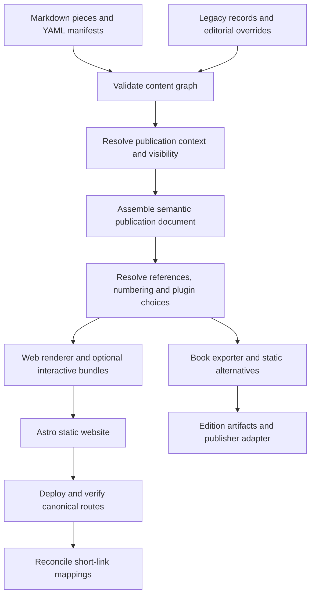

# Technical architecture and implementation decisions

Status: website deployed at the root; private-S3/OAC short-link infrastructure and
Free plan active. New editor controls are local; article alias activation remains
gated by committed content and verified site deployment.
Date: 2026-09-15. These choices implement the [product design](product-design.md)
and [content model](content-model.md); they do not redefine those requirements.
Changing a tool requires updating its adapter/decision, not the editorial model.

## 1. Decision summary

| Area                    | Initial choice                                                                       | Reason / boundary                                                        |
| ----------------------- | ------------------------------------------------------------------------------------ | ------------------------------------------------------------------------ |
| Website                 | Astro, static output                                                                 | Content-oriented rendering with optional interactive islands             |
| Implementation          | TypeScript in strict mode                                                            | Explicit schemas and plugin contracts                                    |
| Runtime/package manager | Node.js 24.21.0 LTS; npm 12.2.0                                                      | Pinned across local, Amplify and GitHub builds                           |
| Authoring               | Markdown + YAML metadata/manifests                                                   | Portable prose and inspectable structure                                 |
| Parsing                 | unified / remark / rehype, with remark-directive                                     | Parse semantic blocks before HTML generation                             |
| Validation              | Zod schemas; exportable JSON Schema where practical                                  | Build validation plus future editor assistance                           |
| Content integration     | Astro Content Collections around a framework-independent content core                | Use Astro for loading/pages without binding the book model to Astro      |
| Styling                 | Versioned themes, validated site configuration, CSS custom properties and scoped CSS | Replace appearance/layouts without rewriting content or publishing logic |
| Code                    | Shiki adapter                                                                        | Build-time highlighting; source code remains portable                    |
| Tables                  | Semantic HTML adapter; structured export adapter                                     | Preserve values/header semantics                                         |
| Charts                  | Vega-Lite adapter, accepting chart-v1 or native Vega-Lite input                      | Shared data/specification with static export                             |
| Diagrams                | Mermaid and D2 adapters; ELK initial layout where supported                          | Different source languages behind a common figure contract               |
| Mathematics             | KaTeX web adapter                                                                    | Typeset equations with a separate book-export path                       |
| Images                  | Image adapter using Astro/Sharp for web derivatives                                  | Keep originals, captions, and export renditions distinct                 |
| Interactivity           | Registered JS modules; Web Workers for computation; WASM where useful                | Load only the requested experiment                                       |
| Browser model runtime   | Replaceable runtime; WebLLM worker adapter                                           | Never a content-model dependency; validate model compatibility           |
| Hosting                 | Existing AWS Amplify app, Amazon Linux 2023                                          | Preserve automatic deployment from main                                  |
| Short links             | Private S3 + OAC; viewer-response CloudFront Function (active)                       | HTTP redirects compatible with the actual existing origin setup          |
| Book output             | Markua export and separate Leanpub adapter                                           | Preserve an independent route to other formats/publishers                |
| Tests                   | node:test for the core; browser testing for the implemented UI                       | Exercise semantics and user behavior at the appropriate layer            |

Use the current stable release of each selected library when the corresponding
phase begins, pin resolved versions in the lockfile, and record tool/binary/font
versions used for edition artifacts. Do not use runtime CDN “latest” imports.
Resolved versions are installed and recorded in package-lock.json. See
[implementation status](implementation-plan.md) and [operations](operations.md)
for actual module locations, commands and account-dependent limits.

The rebuild pins Node 24.21.0 LTS and npm 12.2.0 and uses Astro 7.3.5.
TypeScript remains at 6.0.3 because Astro's checker does not support TypeScript 7's
compiler API. See [dependencies and hosting](dependencies-and-hosting.md) for
version exceptions, install-script policy, and hosted verification.
[Astro setup](https://docs.astro.build/en/install-and-setup/),
[content collections](https://docs.astro.build/en/guides/content-collections/).

## 2. Boundaries and build pipeline


```mermaid
flowchart TD
    A[Markdown pieces and YAML manifests] --> C[Validate content graph]
    B[Legacy records and editorial overrides] --> C
    C --> D[Resolve publication context and visibility]
    D --> E[Assemble semantic publication document]
    E --> F[Resolve references, numbering and plugin choices]
    F --> G[Web renderer and optional interactive bundles]
    F --> H[Book exporter and static alternatives]
    G --> I[Astro static website]
    H --> J[Edition artifacts and publisher adapter]
    I --> K[Deploy and verify canonical routes]
    K --> L[Reconcile short-link mappings]
```

The core uses a typed intermediate document containing prose, headings,
placements, references, citations, and typed blocks. It is independent of Astro
components and any one rendering engine. Book export starts from this document,
not from scraping generated HTML.

Assembly selects a publication target before resolving visibility or assets.
Only assets reachable from eligible pieces are copied into public outputs.
A standalone piece has no collection context; a collection view uses its own
placements, contextual titles, and settings.

Local editorial media currently becomes hashed files in Amplify's build artifact;
explicit `media:` references use the separate S3/CloudFront path. The proposed
[asset release design](asset-release-design.md) introduces a tracked checksum
manifest and shared cache/resolver, first hydrating builds and then optionally
serving web renditions directly from the media CDN. Commit-specific deployment
checks and remote retention are part of that proposal, not implemented features.

Imported external Open Graph data remains a legacy-source adapter. Preserve the existing
precedence of raw cache, imported metadata, and per-field editorial overrides.
Discovery remains an explicit authoring command; production builds consume
reviewed source data and do not silently discover new publications.

Public page metadata is separate from imported external metadata.
`core/social-preview.ts` prepares target-specific JPEG cards from local article
images/collection covers, or branded title cards, through `Assets`. The shared
Layout emits Open Graph, X and JSON-LD metadata. `core/social-metadata.ts` validates
static metadata, `verify-build.ts` checks image bytes, and
`core/social-link-check.ts`/`scripts/verify-social.ts` check public full/short URLs
as crawlers. See [social previews](social-previews.md). This is implemented locally,
not deployed; private social-card preview controls remain pending. Short-link
infrastructure is active, with article alias activation gated by verified deployment.

### Theme and template boundary — required for the rebuild

Keep three layers distinct: the content/publishing core, registered rich-content
renderer plugins, and the site's theme. The core prepares typed page data; a theme
supplies layouts and styling for that data. Themes cannot redefine visibility,
canonical URLs, collection membership, lead selection, or book assembly.

Initial representation:

- `publishing/site.yaml`: brand text, active theme ID, design-token overrides,
  named image/asset references, and supported layout selections.
- `themes/<theme-id>/`: a versioned manifest, default tokens, CSS, named image
  slots, and Astro templates for home/article/collection/archive pages.
- An explicit theme registry resolves IDs to local installed code. Configuration
  cannot fetch or execute arbitrary templates or remote scripts.

Use CSS custom properties for colors, type families/scales, spacing, widths, and
rules. Resolve configured fonts to registered, licensed font assets. Resolve
portrait/decorative-image slots through the asset layer rather than hard-coded
paths inside page templates; keep alt text and relevant crop/focal-point settings
with each slot. Article figures and gallery sources remain owned by content.

Theme defaults are overridden by validated site settings, then optional local
override CSS loaded last. Supported layout IDs can be selected in configuration;
an entirely new structure requires a compatible template implementation. Define
shared page-data contracts and required theme slots so replacement does not require
rewriting articles. Invalid theme/layout/asset references fail the build clearly.
Editorial homepage configuration remains separate from layout configuration.

Theme changes trigger a site rebuild. Include theme/version and resolved visual
settings in relevant rendition cache keys, especially when plugins consume theme
colors or fonts. CSS-only changes do not alter the raw Open Graph metadata cache.
Book render settings are independent; frozen editions retain their recorded
typography and asset versions when the website theme changes.

The existing visual prototype has editable CSS and images but does not implement
this configuration/registry boundary yet. Implement it with the production pages,
and prove a theme change against the same representative content before cutover.

### Initial route plan

- `/` — editorial homepage with curated/default article selection and collections.
- `/writing/<slug>/` — an independently published article.
- `/collections/<slug>/` — a collection introduction and table of contents.
- `/collections/<slug>/chapters/<node-id>/` — an assembled chapter or appendix.
- `/collections/<slug>/read/<placement-id>/` — a piece in its collection context.
- `/archive/` — entry point for historical material; Earlier Work, styled in the new theme. `/original-site/` serves
  The Original Site, the preserved dated snapshot.

Front/back matter and contextual supporting pieces render within their permitted
assembly and do not automatically receive independent routes. Stable placement
IDs supply anchors and disambiguation. Every published page has one canonical
URL appropriate to its context; contextual titles and supporting text belong to
the collection page, while the standalone article retains its own canonical URL.
Track old slugs and generate redirects when they change. Record an explicit
compatibility map for legacy `.html` routes before production cutover.

### Homepage selection

Keep homepage curation separate from article bodies and book order. A small
versioned configuration references an optional lead piece and selected collections
by stable ID. Resolve the lead from that reference or the newest eligible public
standalone piece, then fill the recent list by publication date, excluding the
lead. Use a stable ID tie-breaker. Exact configuration syntax and item counts are
defined during homepage implementation.

Explicit references to missing or ineligible content produce a validation error;
an omitted lead permits automatic selection. Apply publication visibility before
rendering all sections, omit empty sections, and preserve original dates. Render
at build time with no client-side ranking dependency. Update-based editorial
features are explicit; metadata corrections must not silently reorder the feed.
External publication inclusion is a separate editorial decision and must preserve
publisher/destination labels. The initial automatic feed uses first-party pieces.

## 3. Markdown and semantic blocks

### Design prototype boundary

`prototypes/ink-and-paper` is an isolated React/Vite prototype created from the
selected Ink & Paper visual. It uses local sample data and dialog-based reading
to validate appearance and interactions. It does not change the selected Astro,
TypeScript, Markdown/YAML production architecture. Fonts, image assets, and CSS
are candidates for reuse after refinement, not a new content/runtime dependency.
No production deployment or external publishing integration was changed.

### Production authoring

Use ordinary Markdown for prose and simple content. Add directives for references,
reusable blocks, and contextual structures. Parse these with remark plugins into
typed nodes; a rehype stage is used only for the final web output.

The source dialect is versioned as described in [authoring format](authoring-format.md).
The directive parser supplies syntax, not publishing behavior; the content core
implements that behavior. Native MDX/JSX is excluded from the portable prose
format. Interactive code lives in separately registered modules referenced by ID.

This keeps book export from depending on arbitrary UI components embedded inside
paragraphs. An advanced renderer-specific source can still be used when its
format and export alternatives are explicit.
[Astro Markdown processing](https://docs.astro.build/en/guides/markdown-content/),
[remark-directive](https://github.com/remarkjs/remark-directive).

## 4. Plugin contracts

Plugins have versioned IDs, declared input formats, output targets, option
schemas, and capabilities. Static rendering and browser execution use separate
contracts. The signatures below are design interfaces, not implemented APIs.

```typescript
type Target = "web" | "book";

interface RendererPlugin {
  id: string;
  version: string;
  kinds: string[];
  sourceFormats: string[];
  targets: Target[];
  validateOptions(options: unknown): void;
  render(request: RenderRequest): Promise<RenderResult>;
}

interface RenderRequest {
  block: ResolvedBlock; // core-owned semantic block
  target: Target;
  options: unknown; // already validated for this plugin
  assets: AssetResolver; // resolves source-owned, versioned assets
}

interface RenderResult {
  rendition: Rendition; // typed HTML, SVG, image, or structured export data
  assets: GeneratedAsset[];
  dependencies: DependencyVersion[];
  diagnostics: Diagnostic[];
}

interface ExperimentRuntimePlugin {
  id: string;
  version: string;
  capabilities: string[];
  modelFormats: string[];
  backends: string[];
  locality: "local" | "remote";
  probe(request: ExperimentRequest): Promise<CompatibilityReport>;
  load(request: ExperimentRequest, signal: AbortSignal): Promise<Session>;
}

// Session owns run(input, signal), stop(), reset(), and dispose().
// Scenario/state capture is a declared capability, not assumed for every model.
```

The referenced core types will be defined in the first implementation phase.
They must not expose a particular chart library or inference API in the shared
contract. Model-specific capabilities such as token probabilities remain optional.

The publishing core owns captions, accessible descriptions, anchors, numbering,
and cross-references. A plugin supplies the content rendition, not a competing
caption or navigation system. Adapter outputs are validated/sanitized where needed.

### Selection and compatibility

Resolve each target separately, from site to collection to piece to placement to
block, as specified in [authoring format](authoring-format.md). A changed plugin
ID resets inherited options from another plugin; same-plugin options may merge.

A source-format mismatch is an error unless an explicit converter exists.
Replacing a highlighter generally preserves source code. Replacing Mermaid
with D2 requires source conversion; replacing a model runtime may require
compatible weights/tokenization. Do not promise lossless universal interchange.

Plugins are explicitly registered code dependencies. Content cannot install
packages or import arbitrary remote scripts by naming a plugin.

## 5. Static rendering decisions

### Document and presentation adapters

Initial adapters: `pdf-native` for browser PDF viewing, `google-docs-published`
for published Docs, and `google-slides-published` for published Slides. Content
kinds remain `document` and `presentation`; the adapter is independently selected.
Start PDF support with a browser viewer and a direct file link. A richer viewer
can replace that adapter later without changing source identity.

Accept local PDFs or public HTTPS sources. Google adapters accept the published
view/embed URLs provided by Google, validate their host/path, and generate the
iframe themselves. Do not accept arbitrary pasted iframe HTML or treat an edit
URL as a public embed. Remote PDF hosts may disallow framing; retain the direct
link, and require an explicit local snapshot if inline viewing is essential.

Use titled, responsive frames with bounded heights, provider-specific permissions
and a matching Content Security Policy. Load third-party frames on activation by
default. Keep the summary/open-original link outside the frame: cross-origin frame
errors and sign-in screens cannot reliably be detected by the parent page.
The website requires no Google OAuth tokens or access to the publishing account.

#### Publishing from another Google account

For embedded Docs/Slides, use **File → Share → Publish to web → Embed** in the
owning account, then supply the published URL. The resulting view is read-only.
Work/school policies may restrict public publishing. Updates can propagate to
the published view; Slides cannot disable automatic updates. To withdraw a
published view, stop publishing it; sharing permissions are managed separately.
[Google publishing guidance](https://support.google.com/docs/answer/183965?hl=en).

For a normal viewing link, set **General access → Anyone with the link → Viewer**
where available. Viewer access prevents editing/commenting; downloading is allowed
by default. It is distinct from publishing an embeddable version.
[Google sharing guidance](https://support.google.com/docs/answer/2494822?hl=en).

Before including a source, verify the actual viewing/embed URL in a signed-out
browser, including on mobile. The site does not change external permissions.

#### Static output and editions

Every block declares an authored summary/reference or local static alternative.
The selected document adapter handles the book alternative; it never embeds an
iframe in a manuscript. Selected PDF pages/slide images need explanatory text.
Store approved exports as versioned assets, with capture date and computed hash.
Live URLs are references, not immutable edition assets. Permission changes or
withdrawal at Google do not remove copies already exported into this repository.
Builds validate local descriptors and fallbacks without fetching live sources;
remote availability checks are a separate publication preflight.

### Gallery providers and viewers

Add `gallery` blocks with separate source-provider and viewer adapters. Providers
declare whether they can supply a public album link, a verified frame URL, or an
enumerated set of stable image assets and metadata. A native grid/lightbox viewer
requires the last capability; a public album page alone does not provide it.
The initial `icloud-shared-album` provider uses an author-supplied public album
URL. The baseline `gallery-link` viewer renders a title, summary, and album link.
Enable an inline viewer only after testing a real album's framing policy and
signed-out desktop/mobile behavior. No working embed or photo enumeration has
been verified, and a link card must not be described as an embedded gallery.

Apple documents Shared Albums with **Public Website** enabled for anonymous
viewing. Its documentation reviewed on 2026-09-15 does not establish a supported
third-party website embedding interface. Avoid temporary iCloud Links, which
expire after 30 days, and any album configured to expire. Public access must be
checked on the actual album; it is not implied by an ordinary library URL.
[Public albums](https://support.apple.com/guide/iphone/add-and-remove-people-in-a-shared-album-ipha8f8fc3c5/26/ios/26),
[Temporary iCloud Links](https://support.apple.com/en-au/guide/icloud/mm93a9b98683/1.0/icloud/1.0).

Apple's documented traditional Shared Albums reduce photo resolution (normally
2,048 pixels on the long edge), so verify the actual album's quality before using
it for detailed photography or book images; sharing modes can differ.
[Shared Album formats](https://support.apple.com/en-gb/108314).

Do not use undocumented scraping, harvested temporary CDN URLs, Apple credentials,
or an automatic media mirror as the default integration. The build stores only
editorial metadata and references; it does not fetch album photos into the repo
or build output. A future external asset-storage adapter could serve explicitly
selected web derivatives for a custom gallery, but that copying workflow remains
an open choice. Remote previews also require a stable, permitted source; otherwise
render the album card without a thumbnail.

The gallery adapter uses its book target to render the authored summary/reference or approved
versioned external assets with verified hashes. Plain builds need no album access.
Unavailable providers preserve the surrounding article and original album link.
Any verified third-party frame follows the activation/CSP rules above.

### Other static content

- **Code:** preserve code and language; highlight at build time with Shiki.
  Named-region includes are preferred over brittle line ranges for maintained
  examples. Copy controls are optional web enhancement. Book adapters receive
  structured listings and source, not Shiki-specific HTML.
- **Charts:** chart-v1 covers a small shared vocabulary. The initial adapter
  converts it to Vega-Lite. Native Vega-Lite input is permitted for advanced work.
  Pin datasets and record transformations. Render SVG by default, with PDF/PNG
  derivatives when an exporter requires them. Optional interaction loads later.
- **Tables:** preserve typed columns and semantic headers. Browser sorting must
  not change the authored book order. Large tables require an editorial layout.
- **Diagrams:** render Mermaid/D2 during the build. Start with ELK where the
  selected version/diagram type supports it; validate engine-specific options.
  Keep separate adapters and source formats. Layout results need visual review.
- **Math:** use KaTeX for web output. Export semantic math where supported;
  otherwise use a deliberate static rendition and explanation.
- **Figures:** asset processing centralizes widths, captions, descriptions, and
  theme variants. Keep vector originals for diagrams/charts and sufficient
  resolution for raster images. Do not assume a web-sized image is print-ready.

Cache generated assets by source/data hash, selected plugin/version/options,
fonts, and output target. Captions/numbering are contextual and cannot be cached
as if they were global properties of the source asset.

Sources: [Shiki](https://shiki.style/guide/),
[Vega-Lite data](https://vega.github.io/vega-lite/docs/data.html),
[Vega-Lite export](https://vega.github.io/vega-lite/usage/compile.html),
[Mermaid layouts](https://mermaid.js.org/config/layouts.html),
[D2 layouts](https://d2lang.com/tour/layouts/),
[KaTeX](https://katex.org/docs/api).

## 6. Browser experiments

Use custom elements or small framework-independent modules for experiment UI.
Load on deliberate reader activation. Run substantial computation in Workers;
use WASM for workloads or existing libraries that benefit from it. Workers keep
the UI responsive; demonstrations requiring an isolation boundary use a sandboxed
iframe rather than treating a Worker as a security boundary.

Model experiments select a runtime through the registry. WebLLM is the initial
adapter for compatible LLMs, and can be replaced. A model manifest
records source format, exact artifacts/tokenizer, checksums, and compatible
plugins/backends. Backend options include WebGPU and supported WASM paths;
WebNN can be added through an adapter as real device support warrants it.

Probe support before downloading. Show total download/progress, allow cancellation,
and release resources on disposal. Share cached model assets when the browser
permits, with storage limits and an explicit clear action. Do not include model
weights in the normal page bundle or initiate downloads during reading.

Local-only content rejects remote runtimes. There is no automatic cloud fallback.
Unsupported devices show authored static results. Recorded book examples retain
inputs, versions, settings, and actual outputs rather than promising deterministic
LLM generation across hardware.

Sources: [WebGPU](https://developer.mozilla.org/en-US/docs/Web/API/WebGPU_API),
[WebLLM](https://webllm.mlc.ai/docs/),
[Transformers.js](https://huggingface.co/docs/transformers.js/en/index),
[WebNN specification](https://webmachinelearning.github.io/webnn/).

## 7. Short-link integration

### Activation status

The private-S3/OAC short-link resolver and Free plan are active. Live checks passed
for GET/HEAD, cache expiry, updates, direct-origin denial and test cleanup.
Resource inventories and operator identifiers belong in the private operations
note; see [private operations](private-operations.md). DNS, access control and
redirect behaviour must be verified during activation.

### Selected implementation

Use private S3 REST objects with OAC and one viewer-response CloudFront Function.
Each alias stores its destination in S3 redirect metadata; the function converts
that metadata into a real 302. Keep the publication ledger outside the readable
redirect prefix. This supersedes the viewer-request KeyValueStore design.
See [short-link design](short-link-design.md) for freshness, access, pricing,
publication gates and the disposable live test.

The content registry still maps owned codes to content IDs and optional editions
or scenarios. Exact site deployment and public destination checks precede cloud
activation. Snapshot/ownership history and conditional writes support recovery;
site deployment and alias changes are not one atomic transaction.

The provisioner, publisher and editor controls implement the S3/OAC design. The
Free plan is active with a dedicated WAF ACL and attached DNS zone. Local source
changes are not a site deployment: article aliases activate only after committing
the saved registry and verifying its deployed revision and public destinations.
Optional CI access remains unconfigured; operator publication uses the existing
AWS session.

### Cross-posting delivery

Add replaceable destination adapters over the assembled standalone document,
separate from themes and rich-content rendering plugins. Delivery follows verified
canonical deployment and uses a durable remote publication ledger independent of
the Open Graph cache. Target-specific exports, update/conflict handling, capability
checks and provider limitations are specified in [cross-posting adapters](cross-posting.md).
DEV is the first API adapter; Medium starts with assisted import/export.
`core/distribution-media.ts` registers replaceable media capability profiles by
plugin ID, independent of delivery and book rendering. It wraps the web renderers
with PNG asset generation and explicit embed/fallback policy. Rendition bytes
determine asset URLs; review metadata and blocked-copy reports remain private.

## 8. Book exporter

Build a Markua adapter over the assembled document. It emits an ordered manuscript,
resources, cross-references, and any Leanpub-specific manifest files required by
the then-current integration. It never uses generated website HTML as the source.

Resolve contextual heading levels and section numbering, gather citations,
substitute approved static experiment presentations, and package companion links.
Different target formats have explicit capabilities; unsupported constructs
fail preflight until an alternative is supplied.

Leanpub export and publishing are separate steps. Start with a locally reviewable
manuscript export. Introduce remote preview/publishing only in a later integration,
with edition snapshots and clear status reporting. Credentials never enter source
Markdown or a browser bundle. Other exporters can consume the same document.

Sources: [Markua](https://help.leanpub.com/en/articles/5980641-what-is-markua),
[Leanpub manuscript import](https://leanpub.com/blog/lean-publishing-tip-of-the-day-exploring-the-leanpub-manuscript-import-section/).

## 9. Alternatives and deliberate deferrals

- **Quarto:** strong book/document output, but Astro is selected for the bespoke
  personal website; a Quarto export adapter remains possible.
- **Eleventy:** viable static Markdown publishing; Astro's content integration and
  selective interactivity make it the initial website choice.
- **A hosted CMS:** defer until browser editing is a demonstrated need. It must
  round-trip the source model without making publication structure proprietary.
- **MDX for all prose:** avoid making the manuscript depend on executable UI code.
- **A database:** unnecessary for the initial authored content/collection graph.
- **Mandatory React or another UI framework:** defer; add only when an experiment
  benefits enough to justify the dependency.
- **Search and site-wide AI:** no first-release implementation or dependency.

The product model, routes, and source files stay stable if these choices change.
Any genuine format incompatibility gets an explicit migration rather than a
claim that every engine is interchangeable.

## Implemented contracts and limits

The interface examples above describe architectural responsibilities; the exact
TypeScript contracts are in `core/model.ts`, `renderers/registry.ts`,
`runtime/contracts.ts`, `core/books.ts`, and `core/distribution.ts`. Do not copy
an illustrative interface into content configuration. Authoring syntax is in
[the authoring guide](authoring-format.md).

- Astro 7.3.5 generates static routes; the CommonJS legacy generator remains usable.
- Theme Shell/Home/Article components are registered explicitly. Collection/archive
  views use shared semantic layouts and selected-theme CSS. Arbitrary remote theme
  scripts are not loaded from content.
- D2 runs its WASM renderer in a bounded build subprocess. Mermaid uses its CLI
  browser. Vega-Lite produces SVG from versioned local data.
- The experiment registry supplies fields, validation, computation and result
  summaries. Workers run registered trusted code; they are not an untrusted-code
  security boundary. Initial adapters implement the same recurrence in JS/WASM.
- WebLLM uses a worker and a pinned SmolLM2 manifest. Configuration, library and
  tokenizer integrity checks are enabled. Weight shard checksums are recorded;
  the runtime's integrity API does not expose per-shard enforcement.
- Frozen Markua output and a Leanpub API adapter exist. A real Leanpub account
  preview remains unverified; do not claim a locally tested manuscript is a
  remotely rendered book.
- DEV/Medium are unconnected. Delivery state uses local atomic files or private
  S3 conditional writes. Explicit mapping and manual completion commands exist.
- A date-only relaunch boundary in site configuration separates Earlier Work
  from later Elsewhere records. Empty sections remain hidden.

### Reading navigation implementation

`core/reading-navigation.ts` derives visible placement order and chapter bounds
from compiled collection nodes. `ReadingNavigation.astro` shares previous/next,
contents and end-of-collection controls between section and chapter routes.
Published editions independently keep the collection/book index discoverable.
`Header.astro` exposes the current page or section through `aria-current`.
The build injects an Original Site return banner into generated copies only.

## Deployment base and coexistence

`publishing/deployment.json` owns the HTTPS origin, deployment base, indexing policy, and
original-site preservation flag. Content and assembly keep logical root-relative
paths. Astro middleware applies the base to rendered HTML; shared URL helpers
apply it to metadata, feeds, short links, and cross-post media. Astro/Vite use the
same base for bundles and browser workers. Publication checks use the mounted
build marker and reject apply operations for non-indexable previews.

The build writes new-site output beneath the configured base in `dist/`, then
copies the frozen original snapshot to the root when preservation is enabled.
Every original file is verified byte-for-byte. Local preview serves the complete
artifact. Root-only builds use the same pipeline without snapshot packaging.

## Tag vocabulary and private review — implemented locally, 2026-09-20

`core/tags.ts` validates the extensible `content/tags.yaml` registry, resolves labels
and aliases, reads explicitly selected piece sources, and produces unique-piece
counts and advisory findings. `scripts/tags.ts` writes an independent private
HTML/JSON snapshot to ignored `exports/tag-review/`. It is not an Astro route or
input to site packaging. `core/tag-review.ts` supplies its local search, filtering,
sorting, and piece review interface. Public templates use `TagList.astro`; the
private manuscript preview uses the same label renderer. Collection node data
carries piece tags for individual reading pages. No taxonomy data drives book
order, feed eligibility, or automated publication. See [tagging](tagging.md).

## Content review — implemented locally, 2026-09-20

`core/content-quality.ts` extracts source-positioned prose from the existing Markdown
AST, checks selected references/baselines, applies fingerprinted review decisions,
and renders the private report. `scripts/quality.ts` uses the tag source selector,
optionally selects a collection, and invokes the Python JSON worker once per corpus.
`tools/content-quality/analyze.py` combines a pinned spaCy English pipeline with
Snowball stem counts and optional declared-example subprocesses. Model resources
are installed explicitly into an ignored environment, never downloaded by review.
Reports stay in ignored exports, outside Astro routes and site packaging. The local
`prepublish:check` command runs review then the existing Node validation on success;
the deployed build remains Node-only. See [content quality](content-quality.md).

## Content import — implemented locally, 2026-09-20

`scripts/import-content.ts` exposes selection, dry-run/apply, update and fingerprint
options. `core/content-import.ts` inventories canonical sources, expands collection
and adaptation dependencies, and validates the merged library in a temporary
directory before writing. It preserves body/asset bytes and existing publication
identity while making new imports drafts. Destination changes invalidate the plan;
an exclusive lock, exclusive file creation, temporary-file replacement and rollback
on caught failures limit partial writes. Import is not a crash-proof transaction.
No Git operation, publication, NLP, article-code execution or external fetch runs
inside import. See [behavior and commands](content-import.md).

## Full-site authoring preview — implemented locally, 2026-09-20

`core/authoring-preview.ts` snapshots versionable project files into a temporary
workspace, overlays selected canonical sources using the importer, and enables
draft visibility only in that copy. A workspace-bound manifest and explicit local
build flag guard preparation; CI/Amplify reject authoring mode. `preview-authoring.ts`
runs the normal prepare/build/verification pipeline with a root, non-indexable
configuration, then retains only output under ignored `exports/authoring-preview`.
It never writes the original `.generated` or `dist` directories. Layout renders
draft notices and omits analytics only when authoring context is present. The
loopback server serves this separate output; release preview still serves `dist`.
See [lifecycle and options](authoring-preview.md).

Plain preview starts the live workspace with all active local content; quality
checks run on demand. `--snapshot` selects the static builder described above and
runs quality checks before staging. `--release` serves existing deployable output. Piece/collection
schemas normalize optional `draft` metadata to internal status values; absent/false
means published, true means draft. Legacy status is accepted but cannot coexist
with draft in the same file. Import writes new draft flags; preview removes them
only in its isolated workspace. Release builds use unchanged source metadata.

## Homepage discovery and authoring badges

`core/homepage.ts` builds a deduplicated discovery list from standalone article data
and visible collection placements without creating extra standalone routes or RSS
entries. Standalone URLs take precedence for reused pieces; otherwise the first
visible placement supplies the reading URL and chapter context. Known unavailable
features fall back to visible writing. `DraftBadge.astro` reads original source
state from authoring context and emits nothing in release builds.

Homepage `newIn` declarations are validated against source book membership, then
rendered only for visible book/piece pairs. They override the discovery context
label without changing URLs, chronology or the content model. No newness heuristic
runs on collection creation, membership edits or build timestamps.

## Local authoring service

`npm run preview` routes through `scripts/preview-site.mjs` to the loopback-only
editor and isolated live site in `scripts/author.ts`. `core/preview-cli.mjs`
validates modes/options. `--snapshot` invokes the read-only snapshot builder;
`--release` serves existing `dist/`. All modes default to port 4322. The separate
npm author and preview:authoring aliases are removed.
`core/author-store.ts` restricts editable paths and implements revision-checked
atomic saves with an exclusive local lock and ignored durable history. Unsaved
working text is recovered from browser storage. In-memory overrides use the
existing model/assembler/renderer for fast prose feedback; the previous site
template provides presentation. Saved/external changes trigger coalesced isolated
full builds; incremental preparation is not yet implemented. Editor assets and
state are excluded from release output. See [usage and limits](local-authoring.md).

The [review service](editorial-review.md) in `core/author-review.ts` captures
source snapshots, runs the existing Python worker asynchronously, and invokes
fixed CLI adapters in isolated temporary working directories. Review jobs have
cancellation, time/output limits and fingerprints; local reports are ignored
publication artifacts. `authoring/editorial-review.md` is the shared model-neutral
prompt. `authoring/review.js` renders findings as text and guards stale navigation.

### Local illustration service

`core/author-images.ts` manages asynchronous brief/generation tasks and persistent
candidates behind the local author server's authenticated API. It reuses the
restricted agent runner for briefs and enables only Codex built-in image generation
for artwork, requiring ChatGPT login. `authoring/images.js` owns the Images view.
Generation records and images stay in ignored authoring state until explicit
asset preparation/insertion. Shared style is `publishing/image-style.md`; candidate
bytes are format-validated and checksum-verified before article-local insertion.
Generated candidates carry a schema-constrained content-based filename stem from
the same image request. Imports and legacy candidates derive one from their alt
description. Asset names append a checksum suffix; the renderer preserves the
descriptive stem in local image URLs, with a full content hash for cache identity.
For collection files the same service captures current metadata and a resolved
outline for briefs, then assigns an explicit `cover` through a YAML document update
returned to the editor. The server validates collection identity and candidate
ownership; assignment never writes the source file itself.
Brief and generation prompts both include purpose-specific composition instructions
and the selected aspect ratio. The service defaults missing shapes to portrait for
covers and landscape for articles. Cover composition requirements override generic
negative-space guidance and adapt conflicting old briefs to the selected format;
they are prompt guidance, not image-layout validation. Collection assets live
under `content/collections/assets/` and participate in content import. The build's
`core/collection-cover.ts` validates and normalises the image into a hashed WebP,
and compiled collection data carries its URL, alt text and dimensions. Homepage
selection uses that explicit cover; it never derives one from a member article.

`core/author-image-cleanup.ts` owns the private image lifecycle: ownership records,
browser recovery names, expiring per-tab Undo protections, reference scans,
checksum-verified quarantine and eventual trash deletion. The author server queues
sweeps after saves/builds, at startup and daily, using its request queue and the
same on-disk write lock as saves. It defers during builds/image jobs and validates
content before removing files. `authoring/image-recovery.js` mirrors only image
names from browser recovery and active Undo history; saves wait for its request.
`authoring/images.js` refreshes candidates when the cleanup inventory version
changes. See [retention and recovery](image-authoring-workflow.md#automatic-cleanup).

### Finding fixes

`core/author-fixes.ts` validates exact source targets, constructs provider-neutral
requests and runs one isolated CLI job per selected agent. Outputs must match the
provided target indices and original text; invented or duplicate edits fail.
`authoring/fixes.js` compares proposals, guards against source changes and applies
selected non-overlapping replacements in reverse source order as one undo step.
Jobs do not write manuscript files. Results are session-local; preferences can be
remembered in browser storage.

Editorial review requests an explanation plus a concrete edit in a single CLI
response. `replacement.before/after` carries prose; `suggestion` carries rationale.
A nullable `question` identifies missing facts or author decisions and suppresses
any simultaneous replacement. Legacy free-text advice never becomes replacement
text: it needs an explicit drafting request. The fix schema carries advice,
question and answer separately and rejects unanswered questions. Source anchoring
and local checks still gate Apply; changing an answer/scope invalidates the draft.

Local editor interaction helpers in `authoring/ux.js` synchronize the article-text
view with canonical full source, measure wrapped-text selection positions, and
provide article-focused preview, grouped navigation and tag reuse. Local
`catalog` and `tags` endpoints use the editable file allowlist and tag inventory;
neither is part of the static site. Writing-check results and editorial results
are retained separately per file in memory.

### Local browse and edit navigation

Live preview can opt into Node's native server-code watch mode with
`npm run preview -- --watch`. Imported code changes restart the author server;
the existing content/template watcher still rebuilds the served site. Reading
pages reload on a changed session as well as a new build version. The editor
uses its existing token-recovery path without forced reload, protecting in-progress
work; browser script changes need an explicit refresh. Release/snapshot modes
cannot use this flag. No watcher dependency or extra package script is introduced.

The author server maps URLs from its successful staged build to allowlisted
source files by content ID. `core/author-navigation.ts` injects a quiet Edit link
into the served page heading, identically for draft and published content.
Neither source paths nor author links are added to static build artifacts.
The token-protected navigation endpoint resolves the editor return URL only
against this map, preserving collection placement and rejecting arbitrary return
destinations. Editor deep links validate the requested file against the editable
file list. View on site opens the saved page in a separate tab.

The live preview banner also selects draft-inclusive or published-only content.
An authenticated, same-origin `POST preview-mode` changes server-session state and
rebuilds the isolated workspace. Published-only mode skips draft promotion in
`stageAuthoring`; it uses normal content eligibility and homepage selection.
The last successful output and its visibility mode remain active until the new
build succeeds. `authoring/preview.js` polls build state, redirects tabs to the
homepage when the mode changes, and preserves the previous view on failure.
The selector and script are injected only when serving local pages, not packaged
into static output. Restarting the server restores draft-inclusive mode.

### Review decisions and moving source locations

`authoring/review-decisions.js` keeps author decisions in memory per report ID,
kind and finding identity. They are separate from checker output and exported as
`authorDecisions`; a new report never inherits suppression. `lib/finding-range.js`
relocates passage links against the reviewed snapshot using unchanged ranges,
unique exact quotes or unchanged surrounding text. Missing/ambiguous matches
return no range. This navigation is independent of whole-report freshness, which
still guards generated suggestions. Only the local author server serves these
helpers at the existing `/_author/` URLs. Both the range/excerpt helper and
`lib/repetition-batch.js` are shared, dependency-free modules: server code imports
from `lib/`, never from the browser entrypoint directory. Architecture checks
continue to forbid core-to-authoring dependencies.

### Article lifecycle in local authoring

`core/author-lifecycle.ts` implements unpublish and draft deletion behind the same
Host/Origin/token checks as saving. Unpublish uses normal saved-version history.
Deletion prepares a dependency plan, fingerprints source/configuration and owned
assets, then rechecks it under the shared write lock before applying. The entire
piece directory moves into ignored local trash; the recovery manifest contains
before/after dependent settings. Ordinary failures roll back writes; a failed
rollback keeps the lock and reports the recovery path. Process crashes require
manual recovery. Independent filesystem editors do not honor the lock, so this
is single-author tooling rather than a database transaction.

Deletion prunes placements without deleting structural groups, removes homepage
and distribution assignments, and converts aliases into ownership tombstones.
Incoming semantic/prose links and adaptation provenance block deletion. Shared
resources and historical records are retained. This is implemented locally and
does not trigger cloud writes; see [local authoring](local-authoring.md#unpublish-and-delete).

## Planned social publishing and lifecycle architecture

The [technical plan](social-publishing-plan.md) specifies the next changes; none
are implied by the current implementation above. Extract CLI configuration,
adapters, bounded execution and a capability-based picker from review into a shared
assistant service consumed by review, fixes, images and social composition. Keep
task prompts and schemas with their features. Public sharing depends only on the
platform/URL registry and public metadata; it has no assistant dependency.

Centralize canonical/short URL construction, version the alias manifest and reserve
aliases transactionally at first publication. Keep desired link state separate
from deployment-verified live state. Share the social metadata model between
static HTML/cards and the author preview. Build on lifecycle recovery manifests
for versioned Trash entries, conflict-aware restoration and scoped permanent
deletion, with no automatic retention timer. The plan includes migrations, module
boundaries, platform constraints and validation gates.

## Code-analysis execution — implemented 2026-09-25, extended 2026-09-27

`tools/code-analysis/` provides a common runner for the native Git pre-commit hook,
manual worktree validation and CI. It uses a temporary source snapshot with its
own Git metadata and explicitly attached dependency environments. The real index
and working files are not reformatted, stashed or staged. Missing tools, analyzer
failures and absent reports fail closed; checks continue to collect independent
findings. Tool versions, complexity and coverage thresholds are versioned. Reports
remain ignored artifacts; see [code analysis](code-analysis.md) for scope and limits.

The runtime import graph now enforces cycles and browser/server, core/entrypoint
and production/prototype boundaries through `.dependency-cruiser.cjs`. A small
adapter enforces the JSON verdict because upstream JSON output alone does not set
a failing exit status. Type-only and Astro/HTML embedded dependencies are outside
this graph. The advisory report joins function violations with file coverage and
90-day Git commit frequency; raw signals stay separate and missing data stays
explicit. CI retrieves full history; local snapshot metadata preserves shallow
history boundaries. These reports do not change application behavior or thresholds.

Browser tests exercise authoring edits, review decisions, image insertion and
prototype dialogs. Real local server tests use disposable repositories; publication,
analytics and model tests substitute external boundaries. Verified Chromium source
coverage joins Node V8 coverage. The same unified JS/TS command runs locally and
in release validation, with prototype dependencies installed in both CI and Amplify.
