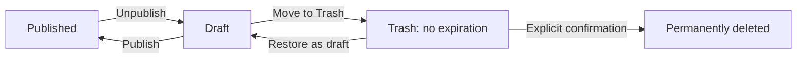

# Social publishing, assistant reuse, short links, and Trash

Status: researched implementation plan, 2026-09-24. The decisions below are the
next development scope, not a claim that these capabilities are implemented or
deployed. The existing local unpublish/delete implementation remains available.
Public sharing is included at the author's request and never invokes an AI
assistant. This document separates product behavior from implementation and
rollout; existing publication, content-identity and privacy rules still apply.

Update, 2026-10-02: private S3/OAC short-link infrastructure, DNS and CloudFront
Free pricing are active. Local editor reservation, deactivation, publication and
GET/HEAD checks are implemented; automatic allocation and richer readiness/composer
integration remain planned. See [short-link design](short-link-design.md).

Update, 2026-10-01: automatic static Open Graph/X metadata, local article/cover
preview cards, title-card fallback, source-language propagation and crawler
verification are implemented and tested locally; see [social previews](social-previews.md).
Explicit social-image overrides, private card preview controls, published-source
fingerprints and platform acceptance remain planned. Nothing in this update
activates the live short-link resolver or publishes to social platforms.

Update, 2026-09-25: the [code-analysis pipeline](code-analysis.md) is implemented
locally and its initial scan exposes blocking existing debt. This begins milestone
0; it does not complete source cleanup or the other milestones. The implementation
uses a native Git hook with isolated snapshots rather than Husky/lint-staged, and
Ruff/ty/Vulture for Python. The remaining sections retain the researched scope.

## 1. Intended experience and decisions

| Surface               | Proposed behavior                                                                                                                                                                                          |
| --------------------- | ---------------------------------------------------------------------------------------------------------------------------------------------------------------------------------------------------------- |
| Public article        | One quiet **Share** button at the article footer. Opens a small panel with Copy link, X, LinkedIn, Bluesky, and the device share sheet where supported. No AI, platform SDKs, counters or tracking pixels. |
| Private article tools | One **Create social post** button for publicly available articles. Opens an in-page dialog with Platform, Format and Assistant selectors, editable output and explicit handoff controls.                   |
| Private navigation    | Content, Short links, Trash, Settings. Preserve the existing writing workspace instead of adding another dashboard.                                                                                        |
| Short links           | A searchable table, newest creation date first, configurable sorting/filtering, one quiet row-action menu.                                                                                                 |
| Assistants            | One configured catalog and shared picker for review, fixes, image briefs, supported image generation and social composition.                                                                               |
| Trash                 | Recoverable removal of drafts. Restore as draft or explicitly Delete permanently. No automatic expiry, cleanup timer or implicit bulk purge.                                                               |

Use an accessible native `<dialog>` for the author composer: focus the first
meaningful control, trap focus, Escape closes, return focus to the trigger, and
preserve edits on close. On small screens use the same dialog at full viewport
size. Generate only on an explicit click; opening the dialog does not consume an
assistant allowance. Keep advanced instructions/model settings collapsed. Remember
last-used platform/format/assistant as local preferences, without silently
substituting a different assistant if the chosen one is unavailable.

The public Share control opens a disclosure/popover containing ordinary links and
buttons, not an application-style ARIA menu unless its full keyboard pattern is
implemented. Include a no-JavaScript fallback link/disclosure. Show clear labels
beside any icons. Do not add separate floating buttons for every platform.

### Author composer

```text
Create social post                                  Close
[LinkedIn v]  [Post v]  [Assistant v]
Uses the published article's language and voice.

[Generate draft]                   [Advanced instructions]

[Editable post, or numbered editable thread items]
[Length / validation]    [Article link]    [Link-card preview]

[Copy text]              [Open LinkedIn]
```

X and Bluesky offer **Single post / Thread**. LinkedIn offers **Post** only.
Thread items can be edited, reordered, split, added and removed; recalculate
numbering and lengths afterward. Do not arbitrarily split at a character count.
A proposed 2–8 post default range is a product preference, not a platform limit.
Warn before replacing edited output with a newly generated variant; keep prior
variants in local history. Display generation, cancellation, unavailable-provider,
validation-failure and stale-source states. Never label a platform handoff as
“Published”: opening a composer cannot confirm that the user posted.

## 2. Current code and gaps

The repository was inspected before this plan:

- `core/author-review.ts` owns the provider union, labels, executable lookup,
  provider argument switches, process cancellation and output handling. Fixes and
  images import infrastructure from that feature module. Provider names also
  appear in request schemas, browser scripts and HTML options. Reuse exists but
  the dependency direction and configuration are wrong for a fourth feature.
- `core/shortlinks.ts` compiles identity-based aliases. The previous lifecycle
  change added deactivation and explicit deletion tombstones. The publisher
  preserves ownership and uses exact-deployment checks and ETags. Keep those
  guarantees; do not replace the resolver with an arbitrary URL shortener.
- Alias allocation is manual. `shortCode` is duplicated between content metadata
  and `publishing/links.yaml`. Link records have no creation/update dates,
  independent enable/disable setting or management UI.
- `publishing/deployment.json` already configures the canonical origin and base
  path. The edge function, provisioner, author validation and lifecycle link
  detection still contain domain-specific assumptions.
- `site/components/Layout.astro` already emits canonical, Open Graph title,
  description, URL, type and image, plus X cards and JSON-LD. The October update
  replaces the shared portrait with prepared local article/cover/title cards and
  passes article language through `ArticleData`. Explicit social-image selection
  and share URLs remain outside that type.
- `core/author-lifecycle.ts` retains deleted source/assets and dependency changes
  under `.authoring-state/trash/`. Restoration is manual. There is no Trash list,
  restore action or permanent-delete action. Some interrupted operations can leave
  recovery manifests that must not be mistaken for completed trash entries.
- At the 2026-09-24 baseline, `npm run validate` ran tests, preparation, Astro/core
  type checks and verified release builds. Prettier packages existed, but there
  was no configured lint/format/dead-code pipeline or active pre-commit hook.
  The [2026-09-25 implementation](code-analysis.md) supersedes that tooling gap.
- Browser authoring JavaScript/inline scripts are not covered by the current core
  TypeScript project. Tests and type checking alone are not complete linting.

The working tree already contains substantial ongoing authoring work. Implement
in bounded changes and preserve it; do not reset, restage indiscriminately or
format the entire repository as a side effect of this plan.

## 3. Platform research and handoff contract

| Platform / format  | Supported or proposed handoff                                                                                              | Constraint and fallback                                                                                                                                                                                                    |
| ------------------ | -------------------------------------------------------------------------------------------------------------------------- | -------------------------------------------------------------------------------------------------------------------------------------------------------------------------------------------------------------------------- |
| X single           | Candidate adapter: `https://x.com/intent/tweet` with encoded `text` and `url`. The endpoint accepted a read-only request.  | Logged-in prefill still needs browser acceptance testing. Old detailed developer intent documentation redirects to the new documentation index. Do not treat endpoint HTTP 200 as proof of prefilled text. Keep Copy text. |
| X thread           | Generate a complete editable thread locally; hand off the first post.                                                      | No verified documented whole-thread intent was found. Remaining items are copied into X's own thread/reply composer. Do not open independent intents and claim they are connected replies.                                 |
| LinkedIn post      | `https://www.linkedin.com/sharing/share-offsite/?url=…`; Copy text, then Open LinkedIn with an explicit paste instruction. | The logged-out endpoint preserves the URL through login. Official sharing documentation promises URL sharing, not arbitrary commentary prefill. Do not rely on undocumented `text`, `summary` or `mini` parameters.        |
| Bluesky single     | `https://bsky.app/intent/compose?text=…` with text and the short URL together.                                             | Officially documented. User still confirms in Bluesky; login may be needed. Validate 300 Unicode grapheme clusters.                                                                                                        |
| Bluesky thread     | Local editable thread; open the first post, copy later items into the native thread/reply flow.                            | Official intent documentation exposes a single compose action, not a multi-post/reply relationship contract. Do not concatenate the entire thread into one `text` query.                                                   |
| Device share sheet | `navigator.share({title, text, url})` from a user action where supported.                                                  | Feature-detect; cancellation is normal. Copy/link fallbacks remain available. No claim that native sharing can select a particular account/platform or create a thread.                                                    |

Sources: [X post button](https://help.x.com/en/using-x/add-x-share-button),
[X thread workflow](https://help.x.com/en/using-x/create-a-thread),
[LinkedIn Share Plugin](https://learn.microsoft.com/en-us/linkedin/consumer/integrations/self-serve/plugins/share-plugin),
[LinkedIn post limits and link sharing](https://www.linkedin.com/help/linkedin/answer/a525301/sharing-articles-or-links?lang=en),
[Bluesky intent contract](https://bsky.network/docs/intent-links/), and
[Web Share API](https://developer.mozilla.org/en-US/docs/Web/API/Navigator/share).

Build all URLs with `URL` and `URLSearchParams`; never concatenate unescaped
article text. Keep known platform destinations in a shared platform registry.
Normal anchors with `target="_blank" rel="noopener noreferrer"` are the reliable
default. Do not open windows after an asynchronous AI response: browser activation
may be lost. A user clicks **Open platform** after reviewing output. If optional
window sizing is used on desktop, retain a normal link when popups are blocked.
Long intent URLs must fall back to copying; no silent truncation.

Do not add authenticated posting APIs in the first release. They introduce a
separate authorization, account-selection, retry and delivery system. The requested
composer can work without storing social-account credentials or automatically
posting. Live acceptance tests stop before sending any post.

### Character and content validation

- X: default to standard 280-weighted-character posts; use official `twitter-text`
  rules, including its fixed URL weight, rather than JavaScript `.length`. Do not
  assume the author or every reader has a premium longer-post entitlement.
- Bluesky: count grapheme clusters, including URL and thread numbering; use
  `Intl.Segmenter` with conformance fixtures and enforce the relevant byte limit
  if an API adapter is ever added. Do not reuse the X counter.
- LinkedIn: enforce the documented 3,000-character post limit; maintain a tested
  platform-specific counting rule and allow a conservative margin for Unicode
  edge cases. The remote composer remains the final authority.
- Validate _final edited text_, including inserted links and numbering, after
  every change and immediately before handoff. Never silently cut a sentence,
  qualification, code fragment or URL to fit.

[X's counting rules](https://docs.x.com/fundamentals/counting-characters) recommend
its open-source parser. Counts, intent behavior and limits belong in versioned
platform adapters with a last-reviewed date, not scattered UI conditionals.

## 4. Voice, language and factual fidelity

This is a release requirement, not an optional prompt preference.

1. Use the published article's complete authored prose, title, summary, language
   and relevant captions as the source. Strip authoring-only instructions and
   renderer configuration. Preserve important quotations and code meanings.
2. Generate from the verified deployed article revision by default. If locally
   saved content differs, explain the mismatch and use the last deployed snapshot
   or wait for publication. Never silently announce an unpublished revision.
3. Derive a short voice description from the source: language/locale, first/third
   person, formality, vocabulary, sentence rhythm, humour and uncertainty. Show it
   under an optional **Voice** disclosure so the author can correct it. It describes
   this article, not a new global marketing persona.
4. The shared prompt requires the same language, stance and level of certainty.
   Platform rules may change length, paragraphing and sequence, but must not add
   hype, engagement bait, invented benefits, statistics, claims, hashtags or emoji.
   Hashtags/emoji are opt-in or follow clear source usage. Translation requires an
   explicit future override, never an automatic platform default.
5. Request a structured result containing language, voice notes and ordered post
   bodies. Keep evidence pointers to source passages for substantive claims as
   private review metadata. The application, not the assistant, selects/inserts
   the exact short URL and performs counters and validation.
6. Validate structure and supported claims as far as deterministic checks allow;
   flag unexpected numbers, unapproved URLs or obvious language drift. A warning
   is not a factual verdict. Human review remains necessary for tone, implication
   and faithful compression. Provide **Revise** with the author's direction rather
   than automatic, repeated paid repairs.
7. Save local variants with source digest, prompt version, assistant/configuration,
   platform, format and creation time. Source/config edits mark prior drafts stale.
   Switching platforms preserves the edited draft for each platform; it does not
   silently rerun a model or overwrite another version.

Test a small curated corpus: reflective English, technical English, Italian,
qualified claims, numbers/quotations, code, and a multilingual/metadata-mismatch
case. Evaluate language, unsupported additions, preserved qualifications and voice
with a written rubric; do not call lexical similarity or another model's score
proof of fidelity. Real CLI smoke runs are explicit and bounded; CI uses fixtures
and fake providers and never consumes assistant allowances.

## 5. Shared assistant architecture

### Configuration and adapters

Add `authoring/assistants.yaml` as the versioned, non-secret instance catalog,
validated with Zod. One catalog defines IDs, labels, enabled/default selections,
engine adapter, optional model defaults and task preferences. Installed executable
paths, machine overrides and credentials do not belong in public content or output.
Use a private operator configuration for executable overrides and retain provider
login stores. UI preferences live in ignored local authoring state.

Proposed shape (not an implemented configuration):

```yaml
schemaVersion: 1
assistants:
  claude:
    label: Claude Code
    adapter: claude-code
    executable: claude
    enabled: true
  codex:
    label: Codex
    adapter: codex-cli
    executable: codex
    enabled: true
  pi:
    label: Pi
    adapter: pi-cli
    executable: pi
    enabled: true
```

The distinction matters: assistant _instances_ are configurable, while each CLI's
protocol belongs in one tested adapter. Do not scatter a three-value union or
provider switches across features. A new instance of an existing adapter requires
only configuration; a genuinely new CLI protocol requires a small adapter, not
changes to review, fixes, images and social UI. A generic stdin/stdout adapter can
be added only with the same validated argument-array/no-shell contract.

Capabilities come from adapter implementation and local probing, then may be
restricted by configuration; configuration cannot magically enable unsupported
image generation or structured output. UI sends an assistant ID and task payload,
never a command, arbitrary arguments or a module path. Unknown/disabled IDs fail
server-side. The public site never receives executable paths or this catalog.

### Proposed modules and contracts

| Module                                    | Responsibility                                                                                                 |
| ----------------------------------------- | -------------------------------------------------------------------------------------------------------------- |
| `core/assistants/config.ts`               | Parse catalog/overrides; validate defaults and IDs; expose sanitized descriptors.                              |
| `core/assistants/adapters/*`              | CLI argument construction, supported flags, output decoding, auth-status checks and task capabilities.         |
| `core/assistants/process.ts`              | Extract existing bounded process runner, timeout, cancellation, process-group termination and output limits.   |
| `core/assistants/service.ts`              | `listAssistants(task)`, `runText(request)` and capability-based `runImage(request)`; shared normalized errors. |
| `core/author-jobs.ts`                     | Small shared job lifecycle: queued/running/succeeded/failed/cancelled, per-file ownership and cancel-on-trash. |
| `authoring/components/assistant-picker.*` | One accessible single/multi-select component, status labels, model disclosure and persisted selection.         |
| Existing review/fixes/images              | Own task prompts and result schemas; consume the service, no CLI switches.                                     |
| `core/social/*`                           | Own social prompts, platform policy, source snapshots, validation and local draft storage.                     |

Use an injected runner in adapter tests. Keep prompt schemas close to their
features; the service is not a monolithic “all AI tasks” module. Do not refactor
unrelated renderers into a new framework. Migrate inline authoring scripts into
explicit ES modules incrementally so components stop depending on implicit
cross-script globals and become lintable/type-checkable.

Prefer native structured output where supported, always validating again with
Zod. Codex documents `--output-schema`; Claude Code documents `--json-schema`;
Pi's protocol needs adapter-level decoding and application validation. Preserve
subscription login behavior: for example, adopting Claude's `--bare` mode merely
to reduce startup work would alter available authentication and is not a drop-in
change. Installed CLI help must be tested against the selected adapter version.

Sources: [Codex non-interactive mode](https://learn.chatgpt.com/docs/non-interactive-mode),
[Claude CLI reference](https://code.claude.com/docs/en/cli-reference), and
[Pi coding-agent documentation](https://github.com/earendil-works/pi/tree/main/packages/coding-agent).
The installed CLI help was inspected without invoking inference or printing auth
material. Installation is not proof of authentication or successful inference.

Run text-only tasks in a fresh temporary directory with tools, automatic context,
extensions/hooks and unrelated integrations disabled using supported adapter flags.
Preserve existing hard boundaries and cancellation tests. Never silently fall back
to an API key, another assistant or a more expensive model. Separate adapter auth
errors from invalid output, cancellation, timeout and unavailable installation.

## 6. Domains and automatic short-link allocation

The selected resolver is [private S3 with OAC and one response function](short-link-design.md).
This supersedes KVS. The resolver and Free plan are active, basic editor controls
are implemented locally and live resolver verification passed. Automatic code
allocation and richer readiness/status reporting remain future work.

### Central URL configuration

Extend the existing deployment configuration rather than introducing a second
canonical-origin setting. Proposed `shortOrigin` is a validated HTTPS origin;
`origin`/`basePath` remain the source for canonical URLs. Keep media delivery origin
in its existing media configuration. Domains in example configs are data, never
constants in functional code. Treat spelling variants in the request as typos,
not additional hostnames to provision.

Introduce reusable `canonicalUrl(target)`, `shortUrl(code)`,
`resolvePublicTarget(target, library)` and `isOwnedUrl(url)` functions. Compare
parsed URL origins and path boundaries, not string prefixes. Resolve piece,
collection and immutable-edition identities using the same module in builds,
authoring, lifecycle cleanup, link management, edge generation and tests.

Render the CloudFront function from validated configuration at provisioning time,
with exact allowed origins and reserved paths. Move account/resource-specific
provisioning inputs to the existing private operations configuration convention.
Do not put inventories, account IDs or test identities in the new public plan or
configuration examples. Preview/staging settings must never publish to production.
Test at least two unrelated domain pairs plus a non-root canonical base path.

### Link identity and schema evolution

Migrate the alias manifest to a versioned schema. A normalized link record needs:
code, identity-based target, createdAt, updatedAt, enabled/removed state, primary
selection and a removal reason/owner where applicable. Availability is _derived_
from target publication and observed deployment, not another manually edited flag.
Keep desired state separate from observed live state.

Use the alias manifest as the single primary-code authority. Migrate existing
piece/collection `shortCode` declarations while preserving the same codes; keep
legacy input compatibility during migration. Immutable edition snapshots must not
be rewritten. Validate any temporary dual declarations for agreement. Retain the
existing ownership ledger and deletion tombstones when upgrading the schema.

For legacy timestamps, recover a trustworthy first-recorded date from history
only if available and label its provenance; otherwise use null/“Unknown” and sort
unknowns last. Never fabricate a historical creation date from a rebuild time.

### Publication transition

1. On an article's first transition to website-public eligibility, atomically
   allocate and persist a primary code in the same local transaction. Prefer an
   existing alias; otherwise use a bounded readable slug and a deterministic
   identity-based suffix on collision. Reserve against active, disabled, trashed,
   removed and remotely owned codes. Repeated requests produce the same result.
2. Changing title or slug never reallocates a code. Explicitly adding a new alias
   is allowed; previously shared aliases stay owned by the same content identity.
3. Cover form edits, full-source edits and CLI/import workflows through the same
   publication service. Provide `publication:prepare --write` for file-based
   authoring, and a read-only `publication:check` gate in CI. A build must not
   silently write source or let a manually edited published article bypass alias
   allocation. Fail with a concrete repair command when a required alias is absent.
4. Collection-only articles require a visible collection placement. Persist the
   chosen public placement so reordering does not silently retarget the short URL.
   If multiple public placements are ambiguous, request a selection. Book-only
   content and drafts have no public sharing action.
5. Deployment still precedes activation. Verify the exact deployed revision and
   target, reconcile the private S3 redirect objects, then record observed readiness. No local save claims
   that the cloud link is already live. Infrastructure must be provisioned and
   verified before enabling the short-link-first workflow.
6. Unpublish deactivates while preserving ownership. Move to Trash records removal
   intent. Restore to draft recovers the same owned reservation without activation.
   Permanent deletion retains a minimal tombstone so old codes cannot be reused.

### Avoid broken links during deployment

There is a real interval between deploying static pages and activating aliases.
A static HTML `shareUrl` alone cannot prove live readiness. Use a small read-only
status endpoint on the configured short-link origin, e.g. `/_link-status/<code>`.
It exposes only an already public mapping and revision/target fingerprint; no
management operations, drafts, credentials or private records. Give it CORS only
for configured site origins, strict code validation, bounded caching and no
arbitrary fetch/redirect capability. Reserve its path prefix. The author server
uses the same contract and additionally verifies the final destination.

When the reader opens Share, check the primary alias on demand; use it when its
resolved target matches the displayed article. Platform sharing and **Copy short
link** require a verified short URL. While activation is pending or cannot be
verified, explain that state and offer an explicitly labelled **Copy full link**
fallback; never silently substitute the canonical URL into a social draft. The
private composer may draft while activation is pending, but its short-link handoff
waits for a verified mapping and tells the author why. Native sharing happens on
the subsequent user click, retaining browser activation. No polling or network
call is needed merely to read an article.

## 7. Short-link management

Route: private `/_author/links/`, linked from author navigation. It must not appear
in the deployed static site. Reuse table/filter/dialog components with Trash.

Default columns: short code/link, article or target title, status, created date,
and row actions. Show long destination URL, last verification and modification
history in a details drawer. Default sort is creation date descending with code
as a stable tie-breaker. Offer creation/update date, title, code and status,
ascending/descending; persist the choice locally and encode filters in the route.
Search code, title and destination. Filter Active, Pending publication, Disabled,
Unpublished, Removed and Needs attention. Label desired-versus-live differences,
including Unknown/unverified, without disguising them as an active redirect.

Operations:

- Copy short URL, open canonical target, inspect details and check availability.
- Create an additional alias by choosing an internal public entity/placement;
  optionally reserve for a draft. Prevent collisions and reserved paths.
- Make an alias primary. Confirm changes to a code by creating a new alias while
  retaining the old one, rather than silently renaming a shared URL.
- Disable/reactivate an alias independently of the article; reactivate only when
  its target is public. Recovering an alias never republishes an article.
- Remove with confirmation and retained ownership; show dependent social drafts
  or content before removal. Never reassign a code to unrelated content.
- Export the selected inventory as JSON/CSV without secrets. CSV cells must be
  safe from formula injection. Add validated import/merge with dry-run conflict
  review only after schema migration is complete; no blind overwrite import.
- Bulk check/copy/export and reviewed disable/restore operations. Avoid one-click
  bulk permanent deletion in the initial release.
- Show Retry publication/operational guidance when live state is stale; keep
  deployment in the existing release workflow, not a hidden editor-side AWS call.

Do not invent click counts: collection of resolver analytics is a separate,
privacy-reviewed feature and is not necessary for link management.

## 8. Article previews on social platforms

Yes: link cards use page metadata. Automatic local metadata/card generation is now
implemented; [the current guide](social-previews.md) supersedes the initial portrait
baseline. Further controls below remain proposed. Keep one shared implementation.
The canonical and short URL must resolve to the same
canonical article HTML; `og:url` and `<link rel="canonical">` remain the full
canonical URL even when a short URL was shared.

Shared metadata now covers title, description, canonical URL, language,
optional locale, article publication/modification dates and image descriptor
(absolute URL, MIME type, width, height, alt text). Feed this into Layout and the
proposed private preview UI. Article language now passes through `ArticleData` to `<html lang>`;
use an explicitly configured locale where a language alone is insufficient.

Proposed override priority: explicit article social image; suitable authored cover image;
otherwise a deterministic branded title card generated with the existing Sharp
pipeline. Default card: 1200 × 630 JPEG/PNG, under a conservative 1 MB budget,
content-hashed filename, high contrast, essential text inside a safe crop region.
Support non-English text and long titles. These dimensions are a cross-platform
starting point, not a guarantee of identical rendering. Do not fetch arbitrary
remote image URLs during builds or invent image alt text without review.

Implemented automatic selection uses the first local raster body image for an
article/reading page and explicit collection covers, then a generated title card.
Explicit overrides, an author preview and cross-environment font determinism are
not implemented. Current cards use JPEG and content hashes.

Emit complete Open Graph fields and image dimensions/alt/MIME, appropriate
article date fields, plus explicit X card/title/description/image/alt metadata.
Use `summary_large_image` for a suitable large image; do not advertise that format
with the current portrait by accident. Metadata and image bytes must be present
without JavaScript, authentication or cookie consent. Only public article data may
enter release metadata/images. Escape attributes and JSON-LD centrally.

Sources: [Open Graph specification](https://ogp.me/),
[LinkedIn website requirements](https://www.linkedin.com/help/sales-navigator/answer/a521928/make-your-website-shareable-on-linkedin?lang=en),
[LinkedIn image guidance](https://www.linkedin.com/help/linkedin/answer/a566445/customize-the-image-and-title-of-a-linkedin-page-post-preview?lang=en), and
[Bluesky external-card model](https://bsky.network/docs/about-bluesky-content/posts/#website-card-embeds).

Keep HTTP redirects for short links, with equivalent GET/HEAD behavior and no
user-agent cloaking or JavaScript redirect page. Test redirect chains and final
metadata as crawlers, then actual platform previews. Open Graph improves previews
but cannot force them: caches, platform policy and client behavior control final
appearance. Bluesky clients construct/store external cards at composition time;
existing cards need not change when page metadata changes. LinkedIn's
[Post Inspector](https://www.linkedin.com/help/linkedin/answer/a6233775) can refresh
metadata for new shares, not retroactively fix all existing posts. Old cached
previews may survive unpublishing; do not promise remote cache erasure.

## 9. Trash, restore and permanent deletion

Keep content states `draft`, `published`, `retired` separate from storage in Trash.
A trashed article is absent from the active library, never a public fourth state.
Rename the current destructive-looking editor action to **Move to Trash…**.
Published articles must first be unpublished; the server enforces that rule.



Public removal follows deployment and alias reconciliation; these arrows describe
the local author workflow, not an immediate change to already deployed pages.

Trash UI: title, deletion time (descending by default), former URL, recoverability
status and a small action menu. Support search and configurable sorting. Open an
item to inspect its source/assets and dependency summary before restoring or
permanently deleting it. Do not run executable preview blocks from trashed content.

Version recovery manifests and include an immutable trash ID, content ID, original
path, original metadata, owned files/hashes, dependency operations and ownership
records. Distinguish preparing/completed/recovery-required operations. Adopt existing
complete manifests; flag incomplete entries for recovery inspection. Absence of a
`complete` marker is not proof of a safely deleted article.

**Restore as draft** must:

- Validate path/ID/slug/code collisions, source hashes, manifest version and current
  dependency revisions. Reject tampered or escaping paths and symlinks.
- Restore the article and owned assets as draft, retaining its stable identity and
  original dates. Restore aliases as inactive reservations for that same identity.
- Reapply individual placements/assignments/promotions using semantic three-way
  merging. Never overwrite an entire current YAML file with an old snapshot.
- Show conflicts such as missing collection parents, moved placement IDs or changed
  promotions. Offer explicit article-only recovery or selected non-conflicting
  dependencies; leave unrelated current content untouched.
- Preserve collection order/structure and comments. A restore does not publish,
  redeploy, send external content or replace immutable editions.
- Run under the same lock/journal/conflict handling as save/trash/publication.
  A failed restore leaves a recoverable trash entry and actionable diagnostics.

**Delete permanently** requires a separate confirmation naming the item and listing
what will be destroyed. Delete the recovery bundle and its exclusively owned local
history/social drafts/image candidates; first cancel owned jobs so they cannot
recreate deleted state. Track ownership explicitly instead of broad directory
matching. Preserve unrelated/shared records and minimal link-ownership tombstones.
Explain that this does not erase Git history, other browser/device copies, external
exports, remote posts or immutable editions; it is not secure erasure.

No automatic expiry. Do not add scheduled pruning, retention defaults or an empty-
Trash shortcut that bypasses item review. Update existing documentation that treats
one-click recovery as deferred only when this implementation is actually complete.

## 10. Free code analysis and commit/CI checks

At the planning baseline there was no active pre-commit pipeline. The subsequently
implemented [pipeline](code-analysis.md) now covers the current languages and adds
blocking complexity/coverage checks. The table below remains the broader proposal,
including additional future analysis such as Semgrep/CodeQL. Dependency-cruiser
and advisory complexity/change-frequency/coverage prioritisation are now implemented.
Use a complementary toolset with
clear responsibilities; running every available analyzer on every commit adds
latency and duplicate findings without establishing correctness.

| Check                            | Proposed tools                                                                                          | Placement                                                                        |
| -------------------------------- | ------------------------------------------------------------------------------------------------------- | -------------------------------------------------------------------------------- |
| Formatting                       | Existing Prettier + Astro plugin; explicit config/check scripts                                         | Staged files; full owned-source check in CI                                      |
| JS/TS correctness                | ESLint flat config + typescript-eslint typed rules                                                      | Staged files and affected project; full CI                                       |
| Astro/browser accessibility lint | eslint-plugin-astro + its accessibility rules; lint authoring ES modules/HTML                           | Commit where relevant; full CI                                                   |
| Types                            | Existing Astro check + strict TypeScript; add authoring browser coverage                                | Whole project when relevant code/config changes; CI                              |
| Dead code/dependencies           | Knip with explicit Astro/custom entrypoints and dynamic registries                                      | Whole project on relevant commits/CI, never staged-file-only                     |
| Architecture                     | dependency-cruiser for runtime cycles and browser→private/Node imports; production/prototype boundaries | Implemented in commit/CI; JS/TS/JSX graph, with exclusions in the analysis guide |
| CSS                              | Stylelint with supported Astro/HTML syntax configuration                                                | Changed owned styles; CI                                                         |
| Python                           | Ruff lint/format/complexity, ty types, Vulture dead code; this supersedes the initial Pyright proposal  | Implemented in commit/CI checks                                                  |
| Secrets                          | Free Gitleaks CLI with redacted output and reviewed allowlist                                           | Staged content and CI/history baseline                                           |
| Workflows/shell                  | actionlint and ShellCheck where actual scripts exist                                                    | Relevant commits/CI                                                              |
| Security patterns                | Semgrep Community Edition, pinned local rules and telemetry off                                         | Focused new-code rules locally; full PR/main CI                                  |
| Deeper security                  | CodeQL JS/TS + Python                                                                                   | GitHub CI; free eligibility confirmed for this public repo before enabling       |
| Vulnerable dependencies          | npm audit and Python dependency audit, pinned runtime/lockfiles                                         | Networked PR/main or scheduled CI; not an offline commit dependency              |
| Runtime/accessibility            | Existing node:test + Playwright and axe; manual keyboard/mobile checks                                  | Unit suite locally; rendered checks before merge/release                         |
| Release/content invariants       | Existing private-content/legacy/link checks plus social metadata, alias ownership, draft exclusion      | CI and release                                                                   |
| Duplication                      | jscpd/reporting or focused repeated-code review                                                         | Advisory baseline; do not force artificial abstraction of tests/content          |

Use ESLint + Prettier for this mixed Astro/TS/HTML/YAML repository. Biome is useful,
but its current Astro support is explicitly experimental; replacing the formatter
and linter stack now is unnecessary churn. Do not also run Biome/Oxlint over the
same rule set unless measured gaps or performance justify it. “Free” does not mean
all hosted actions, proprietary rule packs or inference are free; use the free CLIs
and compatible licenses, not paid cloud features.

Primary references: [ESLint configuration](https://eslint.org/docs/latest/use/configure/configuration-files),
[typed linting](https://typescript-eslint.io/getting-started/typed-linting/),
[Astro linting](https://ota-meshi.github.io/eslint-plugin-astro/user-guide/),
[Knip Astro integration](https://knip.dev/reference/plugins/astro),
[Biome language support](https://biomejs.dev/internals/language-support/),
[Ruff](https://docs.astral.sh/ruff/), [Stylelint](https://stylelint.io/user-guide/get-started/),
[dependency-cruiser](https://github.com/sverweij/dependency-cruiser),
[Gitleaks](https://github.com/gitleaks/gitleaks),
[actionlint](https://github.com/rhysd/actionlint),
[Semgrep CE](https://docs.semgrep.dev/semgrep-ce-languages),
[CodeQL availability](https://docs.github.com/en/code-security/concepts/code-scanning/codeql/codeql-code-scanning),
[npm audit](https://docs.npmjs.com/cli/v11/commands/npm-audit/), and
[Playwright accessibility testing](https://playwright.dev/docs/accessibility-testing).

Implementation decision, 2026-09-25: use the native Git hook with a single Node
orchestrator and staged snapshots; this avoids extra hook/stashing dependencies.
`verify:commit`, `verify:worktree`, `verify:static` and `verify:ci` are implemented;
`verify:push` is not a command. Do not shell-interpolate filenames. Handle staged deletions, spaces,
partially staged files and a dirty working tree. Commit validation must inspect
staged content; whole-project checks use a temporary index snapshot when unstaged
changes would affect the result. Never auto-stage fixes outside the selected files.

Fast commit tier: staged formatting/lint/secrets/schema checks; types, Knip and
architecture when relevant code/config/dependency files changed. Cache only by
source/config/lockfile/runtime fingerprints. Pre-push/full CI adds all tests,
rendered flows, complete build, security and dependency scans. Do not run inference,
network-dependent crawlers or platform login checks at every commit. Benchmark
latency in the first milestone; move genuinely slow scans to CI without falsely
claiming local coverage. Missing required tools fail with setup instructions,
not a successful skipped check. Hooks can be bypassed, so required CI is authoritative.

Account for the nonstandard `site/` Astro source directory, runtime-loaded
renderers, CloudFront entrypoint, command scripts, HTML-loaded browser modules and
Python entrypoints in dead-code configuration. Do not delete them because a generic
scanner cannot see their consumers. Keep generated/exported/legacy vendor artifacts
out of style rewrites, but include relevant release/security validation. Baseline
existing findings explicitly and remove exceptions as addressed; no blanket
`any`, global rule disable or mass rewrite of unrelated ongoing work.

Pin compatible stable tools against the repository's Node/npm/TypeScript/Astro
versions and commit lockfiles. Verify plugin peer compatibility rather than
installing unconstrained `latest`. CI should run on PRs and main pushes; retain
SHA-pinned actions. Review required status checks so direct pushes cannot silently
skip the new source checks. AI-generated fixes are not a mandatory commit gate.

## 11. Ordered implementation milestones

| Step | Deliverable and main files                                                                                                                                                              | Depends on                                               | Completion evidence                                                                                                                            |
| ---- | --------------------------------------------------------------------------------------------------------------------------------------------------------------------------------------- | -------------------------------------------------------- | ---------------------------------------------------------------------------------------------------------------------------------------------- |
| 0    | Record baseline, install compatible analysis tools, configure owned-source scope and staged validation; `package.json`, lint/type/Knip configs, hooks, `.github/workflows/validate.yml` | None                                                     | Existing tests/build preserved; true-positive and false-positive fixtures; staged/unstaged safety tests; timing recorded                       |
| 1    | Extract assistant service/adapters/picker; migrate review, fixes and images; remove repeated provider lists and implicit browser globals in touched features                            | 0                                                        | Contract tests with a fake fourth assistant; old workflows unchanged; cancellation/auth/errors covered                                         |
| 2    | Centralize URL/target resolution and private infrastructure inputs; add versioned link schema, migration and automatic allocation                                                       | 0                                                        | Existing codes unchanged; alternate-domain/base-path tests; atomic publication and concurrency tests; no source writes during build            |
| 3    | Generalize existing save/lifecycle transaction handling just enough for multi-file publication/trash/restore; add Trash list, restore, purge                                            | 2                                                        | Crash recovery, conflict/three-way merge, permanent-delete ownership, no-expiry and no-republication tests                                     |
| 4    | Add Short links management, desired/live status, readiness endpoint and deployment reconciliation reporting                                                                             | 2–3                                                      | Filter/sort/action tests; collisions and ownership enforced server-side; pending/failed publication visible; no public admin routes            |
| 5    | Partly implemented locally: automatic shared metadata/cards and language propagation; explicit selection/UI and published-source fingerprints remain planned                            | 2 for full scope; automatic metadata works independently | Static metadata/image assertions, visual card inspection and simulated full/short crawler checks pass; live activation/platform checks pending |
| 6    | Add public Share component and platform registry; explicit Copy full link fallback while aliases are pending                                                                            | 4–5                                                      | No AI/network-on-read; keyboard/mobile/no-JS/copy/popup tests; alternate-domain tests                                                          |
| 7    | Add private social composer, local variants, platform counters, source/voice constraints and thread handoff                                                                             | 1, 4–5                                                   | Fake-provider integration suite; curated voice review; all five requested platform/formats; stale-source and pending-link safeguards           |
| 8    | Operational activation, logged-in handoff/card acceptance, production deployment and verification                                                                                       | 3–7                                                      | Verified resolver/DNS/TLS, exact revision and active aliases; public and private acceptance matrices pass; no test posts sent                  |

Steps 1 and 2 are independent after the baseline, but implementation should remain
reviewable and avoid concurrent edits to shared authoring files. Each milestone
updates README and affected docs, labels actual implementation/testing/deployment
status, and carries a focused regression check. Do not ship the UI as “ready” while
its short-link infrastructure or platform handoff acceptance is unresolved.

## 12. Test and acceptance matrix

| Area               | Required cases                                                                                                                                                                                                                                              |
| ------------------ | ----------------------------------------------------------------------------------------------------------------------------------------------------------------------------------------------------------------------------------------------------------- |
| Assistant registry | Reorder/disable/rename instances; fake fourth provider; unsupported capability; missing binary/auth/model; invalid JSON; timeout/cancel/output cap; no shell or source edits; provider picker consistency across all features.                              |
| Social source      | Verified published snapshot; unsaved/newer local version; deleted/unpublished article; collection-only public placement; book-only/private content; stale generated output.                                                                                 |
| Voice              | Same language, stance, technical meaning and qualification across five formats; no new statistics/claims; opt-in hashtags/emoji; author comparison against the source.                                                                                      |
| Counters           | ASCII, Italian accents, composed/decomposed Unicode, CJK, emoji/ZWJ, URLs, numbering and edits at exact limits; full thread never silently truncated.                                                                                                       |
| Intents            | URL encoding, line breaks, ampersands, fragment/query URLs, long drafts, popup blocking, clipboard failure, login continuation, mobile deep links; thread continuity must remain explicit/manual when unsupported.                                          |
| Links              | Auto-allocation and idempotency; collision/race; old-code retention; date sorting including nulls; alias primary changes; disable/restore/remove; partial deployment; unknown remote owner; alternate domains/base path; import dry run and CSV safety.     |
| Trash              | Published-delete rejection; dependency cleanup; source/asset recovery; missing parent/conflicting slug/code; restoration preserves unrelated edits; partial-write recovery; tampered manifests; purge scoped to owned data; no automatic expiration.        |
| Metadata           | Both canonical and short URL resolve to identical public title/description/image/canonical; correct language/date fields; image type/bytes/dimensions/alt; redirect/HEAD parity; unavailable drafts and removed aliases; no draft text in generated assets. |
| Public UI          | One compact control; keyboard/focus/Escape; mobile layout; no JS fallback; no AI catalog or admin endpoint bundled; no third-party scripts or requests before sharing.                                                                                      |
| Private UI         | Accessible dialog/table; draft persistence; provider switches; generation failures; cancel; reviewed replacement; source changes; distinct copied/opened versus posted state.                                                                               |
| Analysis pipeline  | Staged file additions/deletions/renames/spaces, partial staging, dirty trees, missing tools, offline commits, cache invalidation, deliberate lint/type/dead-code/secret fixtures, CI cannot falsely pass skipped checks.                                    |

Automated browser tests run against disposable local content and fake platform
routes/providers. Actual signed-in platform checks verify prepopulation and card
rendering without clicking Publish. If login or platform access prevents a check,
record it as unverified, not passed. Automated accessibility tests complement
manual keyboard/focus checks. Production verification includes old legacy URLs,
feeds/sitemap, primary aliases, draft exclusion, immutable editions and the absence
of all private authoring state in artifacts.

## 13. Research limits and rollout risks

- Read-only requests confirmed the current full article serves basic OG tags and
  the sharing endpoints respond (LinkedIn redirects through login). They did not
  verify authenticated prefill or an actual platform card.
- Live short-link resolution was not established in this investigation. Treat
  DNS/TLS/resolver provisioning and permission setup as a release prerequisite;
  detailed operator diagnostics belong in the private operations note.
- Existing X documentation URLs redirect to a general index. Preserve a copy/paste
  fallback and require a real handoff check rather than relying on stale examples.
- No documented whole-thread intent was found for either X or Bluesky. Fully
  automatic thread posting is a separate future API feature, not an untested
  promise in this release.
- Preview caches and already published external content are outside website
  deletion control. Restore and permanent-delete flows must describe that boundary.
- No new social features, Trash UI or provider registry were implemented by the
  planning change. Analysis hooks were added separately on 2026-09-25; their
  [guide](code-analysis.md) records actual coverage and remaining findings.
